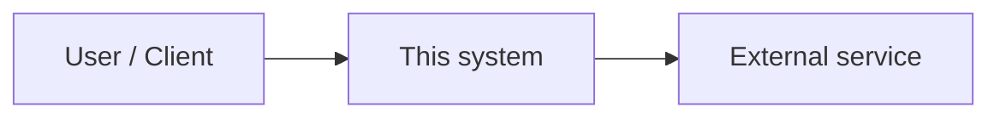

# Technical design document template (markdown)

Paste-ready structure for a TDD. Omit sections that do not apply; use **N/A** with one line why if stakeholders expect the heading.

Link the controlling PRD in document control. **Trace every major design block to FR/NFR IDs** from that PRD.

---

# [Feature / system area] — Technical design

## Document control

| Field | Value |
|-------|--------|
| **Author** | |
| **Engineering owner** | |
| **Reviewers** | |
| **Status** | Draft / In review / Approved |
| **Version** | 0.1 |
| **Last updated** | YYYY-MM-DD |
| **Related PRD** | Link + version |
| **Related docs** | API catalogs, threat models, runbooks |

---

## 1. Summary

- **Objective:** [One paragraph: what this design delivers technically]
- **Non-goals:** [What is explicitly out of scope]
- **Key decisions:** [2–5 bullets — link to ADR appendix if needed]

---

## 2. Context

- **Problem (from PRD):** [Short; link PRD section]
- **Users / systems affected:** [Who or what touches this]
- **Constraints:** [Regulatory, platform, timeline, dependencies]

### 2.1 Context diagram

*(Replace with accurate actors and boundaries.)*

---

## 3. Requirements traceability

| PRD ID | Requirement summary (short) | Design coverage |
|--------|------------------------------|-----------------|
| FR-001 | | Section / component |
| NFR-001 | | Section / mechanism |

Add rows until all in-scope FR/NFR from the PRD are mapped or explicitly deferred with rationale.

---

## 4. Architecture

### 4.1 Components

| Component | Responsibility | Owner / repo (if known) |
|-----------|----------------|-------------------------|
| | | |

### 4.2 High-level flow

[Sequence or data flow — mermaid or numbered steps]

### 4.3 Technology choices

| Area | Choice | Rationale | Alternatives considered |
|------|--------|-----------|-------------------------|
| | | | |

---

## 5. Data design

- **Entities / aggregates:** [What is stored; ownership]
- **Schema or model:** [Tables, documents, fields — or link to migration / ORM]
- **Consistency:** [Strong vs eventual; source of truth]
- **Retention / deletion:** [If PII or compliance NFRs apply]

---

## 6. Interfaces

### 6.1 APIs (REST / GraphQL / RPC)

For each surface: purpose, auth, idempotency, error model, versioning.

| Method + path / operation | Purpose | Request / response (summary) | Errors |
|---------------------------|---------|--------------------------------|--------|
| | | | |

### 6.2 Events / async

| Topic / queue | Producer | Consumer | Payload summary | Ordering / retries |
|---------------|----------|----------|-----------------|-------------------|
| | | | | |

### 6.3 External integrations

| System | Direction | Protocol | SLA / failure handling |
|--------|-----------|----------|------------------------|
| | | | |

---

## 7. Security & privacy

- **Trust boundaries:** [What crosses untrusted networks]
- **Authentication / authorization:** [Models, tokens, roles — map to FR/NFR]
- **Sensitive data:** [Classification, encryption at rest/in transit, logging redaction]
- **Threat notes:** [Top risks and mitigations — short]

---

## 8. Performance & scalability

- **Targets:** [Cite NFR IDs: latency, throughput, concurrent users]
- **Hot paths & bottlenecks:** [Caching, batching, pagination, quotas]
- **Capacity:** [Rough sizing or “TBD — load test before launch”]

---

## 9. Observability

- **Logging:** [What is logged; correlation IDs]
- **Metrics:** [SLIs if applicable]
- **Tracing:** [If distributed]
- **Alerts / runbooks:** [Links or “create with SRE”]

---

## 10. Rollout & operations

- **Feature flags:** [Keys, default, removal plan]
- **Migrations:** [Forward/rollback; data backfill]
- **Backward compatibility:** [API versioning, dual-write period]
- **Deployment order:** [If multiple services]

---

## 11. Testing strategy

| Layer | Scope | Notes (tie to acceptance criteria) |
|-------|-------|-------------------------------------|
| Unit | | |
| Integration | | |
| E2E | | |

---

## 12. Risks, open questions, decisions

### Risks

| Risk | Impact | Mitigation |
|------|--------|------------|
| | | |

### Open questions

| # | Question | Owner | Due |
|---|----------|-------|-----|
| | | | |

### Architecture decision records (appendix)

**ADR-001 — [Title]**  
- **Context:**  
- **Decision:**  
- **Consequences:**  

---

## Appendix

- **Glossary** (if terms differ from PRD)
- **References** (runbooks, dashboards, other designs)
