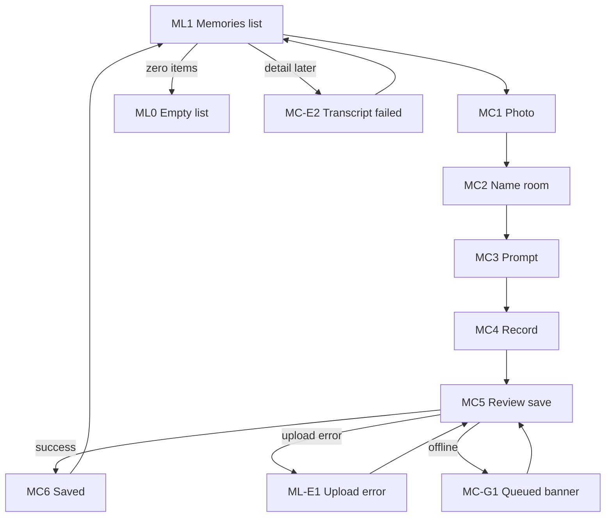

# Memories — design wireframes (low-fi + states)

## Document control

| Field | Value |
| --- | --- |
| **Title** | Memories — wireframes |
| **Version** | 1.0 |
| **Edition** | **v1** — filename `design-wireframe-v1.md` (use `-v2.md` etc. for major rewrites) |
| **Date** | 2026-04-22 |
| **Author** | Draft (from PRD v1.0 + TDD v1.0) |
| **Fidelity** | Low-fi ASCII + state coverage; **hi-fi** in [memories-user-workflow-v1.md](memories-user-workflow-v1.md) |
| **PRD** | [product-requirements-v1.md](product-requirements-v1.md) |
| **TDD** | [technical-design-v1.md](technical-design-v1.md) |
| **Template used** | `docs/templates/design-wireframe-template.md`; `.cursor/skills/designer-wireframe/SKILL.md` |

---

## Summary

This doc adds **screens and states not covered** by the committed hi-fi screenshots: **empty memories list**, **upload failure**, **transcription failed**, and **offline / saving** banner behavior. The **happy-path capture flow** (MC1–MC6 + list ML1) is illustrated in **PNG form** in [memories-user-workflow-v1.md](memories-user-workflow-v1.md)—do not duplicate those layouts here; reference that file for visual design.

**Principles:** **Mobile-first**, **NFR-012** (elder-friendly: few choices, plain language, large targets), trace screens to **FR** where noted.

---

## Hi-fi reference (do not redraw)

| Wireframe ID | Step | Hi-fi |
| --- | --- | --- |
| **MC1** | Photograph | [memories-user-workflow-v1.md §1](memories-user-workflow-v1.md) |
| **MC2** | Name & room | §2 |
| **MC3** | Prompt | §3a |
| **MC4** | Recording | §3b |
| **MC5** | Review & save | §4 |
| **MC6** | Success | §5 |
| **ML1** | Memories list | §6 |

---

## Screen inventory (supplementary)

| ID | Surface | Purpose | Primary actor |
| --- | --- | --- | --- |
| **ML0** | Memories list **empty** | First visit or cleared list; invite capture | Guide / family |
| **ML-E1** | Upload / save **error** | Photo or audio failed to reach server; retry | Guide |
| **MC-E2** | Transcript **failed** | STT failed; show message + retry or save without transcript | Guide |
| **MC-G1** | **Offline / queued** banner | Work saved locally; “Will send when online” | Guide |
| **MC-G2** | **Saving** spinner | In-flight idempotent save after connectivity returns | Guide |

---

## Flow (happy + error branches)



---

## Low-fi layouts (supplementary states only)

### ML0 — Empty memories list [FR-010]

```
+------------------------------------------+
| <   [EK] Eleanor Kim     [In Transition] |
| Overview | Journey | Memories* | Docs  |
+------------------------------------------+
|  NO MEMORIES YET                         |
|  One short reassuring line of copy.      |
|                                          |
|  [    Capture first memory (large)   ] |
|                                          |
|  (optional: small “What is Memories?”)   |
+------------------------------------------+
```

- **Primary CTA:** one button → opens **MC1** capture flow.
- **Secondary:** none on first version unless PM adds help link.

---

### ML-E1 — Upload / save failed [FR-011, FR-014]

Shown as **modal** or **inline banner** on top of MC5 (review) or after failed finalize.

```
+------------------------------------------+
|  ! Couldn't save yet                     |
|  Check your connection and try again.    |
|  [ Retry save ]     [ Keep editing ]     |
+------------------------------------------+
```

- **Retry** reuses same idempotency key (**FR-013**).
- No technical jargon in copy (**NFR-012**).

---

### MC-E2 — Transcription failed [FR-009]

On **memory detail** or inline on card after list refresh.

```
+------------------------------------------+
|  Mom's Wedding Ring                      |
|  [ photo ]  [ play audio ]               |
|                                          |
|  Transcript unavailable                  |
|  We couldn't turn the recording into     |
|  text. You can retry or continue without.|
|  [ Retry transcript ]  [ Dismiss ]       |
+------------------------------------------+
```

- **Retry** kicks job again; **Dismiss** leaves memory valid without transcript.

---

### MC-G1 — Offline / queued [FR-014]

**Banner** below header on any capture step after local save.

```
+------------------------------------------+
|  ~ This memory is saved on this device   |
|    and will upload when you're online.   |
|    [ OK ]                                |
+------------------------------------------+
```

- Non-blocking where possible; **OK** dismisses for session (banner may return next visit if still queued).

---

### MC-G2 — Saving in progress

Thin **inline** status above primary CTA on MC5.

```
|  Saving… please keep this screen open.   |
|  [=========>·······]                     |
```

---

## Global patterns

| Topic | Guidance |
| --- | --- |
| **Touch** | Primary actions full-width where possible; min target **44px** equivalent (**NFR-012**). |
| **Errors** | One sentence **what** + one **what to do**; never raw status codes. |
| **Loading** | Prefer skeleton on list; spinner on save only when blocking. |
| **Focus** | Dialogs trap focus; Escape returns to predictable step (per frontend-ui skill at build time). |

---

## Traceability

| Screen ID | FR / NFR |
| --- | --- |
| ML0 | **FR-010** (empty state UX) |
| ML-E1 | **FR-011**, **FR-013**, **FR-014** |
| MC-E2 | **FR-008**, **FR-009** |
| MC-G1, MC-G2 | **FR-014**, **NFR-003** |
| All MC\*, ML\* | **NFR-012**, **NFR-004** |

---

## Open questions

1. **Empty list:** Is “Capture first memory” always shown, or hidden when user is read-only family?
2. **Upload error:** Modal vs sticky banner—preference from design review?
3. **Transcript failed:** Only on detail view, or also toast from list?

---

## Revision

| Version | Date | Summary |
| --- | --- | --- |
| 0.1 | 2026-04-22 | Initial: hi-fi pointer, supplementary states, mermaid, ASCII |
| 1.0 / file v1 | 2026-04-22 | Renamed to `design-wireframe-v1.md`; doc version 1.0 |
