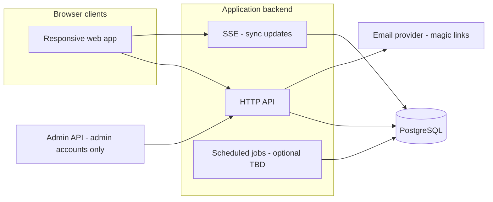

# Multi-list web app — technical design

> **Repository note:** This file is a **sample** preserved under [`docs/examples/README.md`](../README.md). For new technical designs, use [`docs/templates/technical-design-template.md`](../templates/technical-design-template.md).

## Document control

| Field | Value |
| --- | --- |
| **Author** | Ken Levy |
| **Engineering owner** | Ken Levy |
| **Reviewers** | AI Agent |
| **Status** | Draft |
| **Version** | 0.25 |
| **Last updated** | 2026-04-22 |
| **Related PRD** | [product-requirements.md](product-requirements.md) v0.28 |
| **Related docs** | [tech-stack.md](tech-stack.md) v1.19; [design-wireframe.md](design-wireframe.md) v0.50; [development-plan.md](development-plan.md) v1.15; [implementation-log.md](implementation-log.md); [runbook.md](runbook.md); [adr/README.md](adr/README.md); [status.md](status.md); **v1.1 delta:** [technical-design-v1.1.md](technical-design-v1.1.md) (**invite email §9A**); full PRD (planned) |

## AI-first delivery assumptions

- This repository uses an AI-first delivery model: AI agents are expected to design, implement, review, and maintain code by default.
- Architecture trade-offs, implementation sequencing, and complexity discussion should assume AI-assisted execution by default.
- If a design area is expected to require materially higher human-only effort assumptions, call it out explicitly in Risks or Open Questions.

---

## 1. Summary

- **Objective:** Deliver a browser-based multi-list product with email identity, server-authoritative list/item/share state, duplicate (snapshot) and sync collaboration modes, invite lifecycle (72h rolling expiry, final-only server outcomes), ownership/succession rules, and **in-app notification surfaces** for sharers and invitees (**FR-S10**, **FR-S16**). **MVP** did **not** include **transactional “you were invited” email** (only **magic-link** mail for sign-in). **v1.1** adds **invite delivery email** (outbox, one-time token, accept route) — [technical-design-v1.1.md](technical-design-v1.1.md) **§9A**, **FR-V11-S01** in [product-requirements-v1.1.md](product-requirements-v1.1.md). Implementation is **online-only** for MVP (no offline queue).
- **Non-goals (technical):** Phone/SMS auth; **SMS** or **push** notifications; **marketing** or **digest** email for product events; client-side offline reconciliation (**FR-OF\***); product-mandated API rate limits; exposing item text to support (**NFR-08**). **Transactional** invite email is **v1.1** (not MVP). **MVP** excludes **password** auth; **post-MVP** adds **password** sign-in and limits **magic links** to **first-time** login (PRD).
- **Key decisions:**
  - **Single logical backend** owns all mutations; clients are thin — satisfies **FR-L09** final-only commits and **FR-S15** server ordering.
  - **Relational core:** **PostgreSQL** is the system of record for lists, memberships, invites, audit — strong consistency for share rules and **FR-S14** succession.
  - **Real-time sync lists:** **SSE** (recommended for MVP) per active sync list for server→client pushes; mutations stay on REST. If SSE is insufficient later, upgrade path is WebSocket. Fallback: **consistent read-after-write** on refresh (**FR-S02**).
  - **Duplicate accept:** transactional **copy** of list + items at accept time (**FR-S01**).

---

## 2. Context

- **Problem (from PRD):** Users need many independent or shared lists with clear roles, safe invite handling, and accessible UI (**NFR-04**).
- **Users / systems affected:** End users (mobile/desktop browsers); support tooling consumers (**NFR-08**); email provider for verification/login (**MVP scope**).
- **Constraints:** HTTPS everywhere (**NFR-01**); WCAG 2.2 AA-oriented core flows (**NFR-04**); no regulated-product data schedule in the PRD — baseline security still required.

### 2.1 Context diagram

---

## 3. Requirements traceability

| PRD ID | Summary | Design coverage |
| --- | --- | --- |
| **FR-L01**–**FR-L08**, **FR-L10** | Lists CRUD, validation, undo window | §5 Lists aggregate; §6 list APIs; **server tombstone** + `deleted_at` with 30s undo window (**FR-L08**) |
| **FR-L03**, **FR-L04** | Name uniqueness (per user), 50 code points | §5 validation; DB constraint + app Unicode length |
| **FR-L05**, **FR-L06**, **FR-L07** | Unlimited lists, empty/zero state | §5; no artificial cap in schema |
| **FR-L11**, **FR-L12** | Private/Shared; sync participant roster | §5 membership + §4 derived flags; §6 read models |
| **FR-L09** | Online accept; collision UI; pending vs final | §5 Invites; §6 accept/rename/decline; no partial membership |
| **FR-I01**–**FR-I05** | Items add/toggle/delete/done styling | §5 Items; §6 item APIs |
| **FR-O01**–**FR-O05** | Alphabetical vs custom order | §5 `order_mode`, `custom_position`, `created_at` |
| **FR-S01** | Duplicate snapshot | §5 copy-on-accept transaction |
| **FR-S02** | Single sync list, edits visible | §5 sync membership; §6 + **SSE** push |
| **FR-S03**, **FR-S04**, **FR-S08** | Leave / copy rules | §6 leave endpoints; §5 copy rows |
| **FR-S05** | 72h rolling expiry | §5 `invite_expires_at`; **lazy evaluation on read** (§5.3) |
| **FR-S06**, **FR-S11** | Independent invite outcomes | §5 one row per invitee |
| **FR-S07**, **FR-S09** | Remove; copy naming | §6 remove; copy without FR-L09 dialog |
| **FR-S10** | Sharer in-app notifications | §5 `notifications` or poll feed; §6 `PATCH` per id + **`POST /notifications/read-all`** for **N1** |
| **FR-S12**, **FR-S13** | User vs Co-owner; reshare | §5 `role` on membership; §6 authz |
| **FR-S14** | Delete / min owner / succession | §5 domain service; §6 account-close hook |
| **FR-S15** | Title last-writer-wins | §5 `title_version` monotonic |
| **FR-S16** | Pending-invite toast (all) | §6 list pending invites; client UX |
| **NFR-01** | HTTPS | Infra + HSTS **TBD** |
| **NFR-02** | Authz per user/share | §7; middleware on all resources |
| **NFR-03** | Responsive | Front-end **TBD** stack |
| **NFR-04** | A11y | Front-end patterns; API supports labels |
| **NFR-05** | Secure session/tokens | §7 cookies or bearer **TBD** |
| **NFR-06** | No email/SMS/push notifications | §5 in-app only |
| **NFR-08** | Support: membership, titles, audit — not items | §5 audit schema; §6 support APIs |
| **FR-OF01**–**FR-OF03** | Offline / reconciliation | **Deferred** — see §12 |

---

## 4. Architecture

### 4.1 Components

| Component | Responsibility | Owner / repo (if known) |
| --- | --- | --- |
| **Web client** | UI, a11y, toasts (**FR-S16**, **FR-S10**), optimistic **TBD** only where safe; **T2** share dialog collects invitees via **Invitees** rows only and may show **registered / not registered yet** per valid email via `POST /users/lookup-emails` (aligned with [design-wireframe.md](design-wireframe.md) **T2**) | TBD |
| **HTTP API** | Auth, lists, items, invites, notifications, support | TBD |
| **Realtime gateway** | Broadcast sync list changes (**FR-S02**) | Optional MVP |
| **Worker / scheduler** | Invite expiry sweep (**FR-S05**), notification fan-out **TBD** | TBD |
| **PostgreSQL** | System of record | Ken Levy |
| **Email provider** | Magic-link delivery | TBD vendor |

### 4.2 High-level flows

**Accept duplicate (happy path):** Client `POST /invites/{id}/accept` → server validates online session, invite pending & not expired → if name collision with user’s library, return `409` + conflict payload → on rename of *existing* list, `PATCH` list then retry accept in same transaction **or** single endpoint with `rename_existing_list_id` + `new_name` → server creates new `list` + `items` copy from snapshot source → invite → `accepted`.

**Sync edit:** Client `PATCH` item/list → server checks membership role (any participant may edit per PRD) → persist with **FR-S15** rules for title → push update via **SSE** to subscribed clients (or return updated resource on poll/refresh).

**FR-S14 succession:** Trigger on owner removal, leave, or account closure → if no owner and Users remain → query Users by earliest `accepted_at` → if tie, server **PRNG uniform** among tied user IDs → promote one to `co_owner` (or equivalent owner flag) → persist **without** logging PRNG internals per PRD.

### 4.3 Technology choices

| Area | Choice | Rationale | Alternatives considered |
| --- | --- | --- | --- |
| **Datastore** | PostgreSQL | FKs, transactions for accept + copy; row locks for title version | Dynamo-style (harder for **FR-S14** + joins) |
| **HTTP API** | **Fastify** | REST + SSE-friendly; matches `apps/api` implementation | Hono (not selected for MVP) |
| **Auth (MVP)** | **Magic links** (email) | No password surface in MVP; PRD email verification via link | — |
| **Auth (post-MVP)** | **Password** + **first-login magic link** | Returning users: email + password (hash at rest, reset flow **TBD**). New users: magic link for **first** successful login only; thereafter password. | Magic-only forever; OAuth-only |
| **Realtime** | **SSE** | One-way push fits “server authoritative”; simple ops vs WebSocket; REST for writes | WebSocket (if bidirectional/low-latency needs grow); long poll (fallback) |
| **IDs** | UUID v7 or ULID **TBD** | Sortable, safe exposure | Sequential ints (leak volume) |

---

## 5. Data design

### 5.1 Entities (logical)

- **User** — `id`, email (unique, verified flags), `created_at`, `closed_at` nullable (account closure hooks **FR-S14**); **`is_admin`** boolean (or role) for **NFR-08** support API access only when true. **MVP:** **Magic link** auth only — **no** `password_hash`; store session + `magic_link_tokens` as needed (**NFR-05**). **Post-MVP / v1.1:** add **`password_hash`** using **Argon2id** only (see [technical-design-v1.1.md](technical-design-v1.1.md) §3.1), flags or timestamps for **first-login** vs **password-ready**, plus reset-token table per v1.1 TDD; magic-link request path restricted to **first-time** / recovery flows per PRD.
- **List** — `id`, `owner_user_id` (library owner for *private* lists and for duplicate copies), `title`, `title_version` (int, monotonic — **FR-S15**), `type` enum: `private` \| `sync_master` **TBD naming** — one row per sync list; duplicate recipients get new list rows.  
  - **Clarification:** For **sync**, one canonical `list` row represents the shared list; **list_members** link users to that list with roles. For **duplicate**, each accept creates a **new** `list` owned by the invitee.
- **Item** — `id`, `list_id`, `text`, `done`, `created_at`, `updated_at` (server-set), `sort_key` for custom order **TBD** (fractional indexing or integer position with reorder algorithm).
- **List membership** (sync only) — `list_id`, `user_id`, `role` enum: `creator` \| `co_owner` \| `user`, `accepted_at` (for **FR-S14** ordering), `removed_at` nullable.
- **Invite** — `id`, `list_id` (source list), `invited_email`, `invited_user_id` nullable (resolved when known), `mode` enum: `duplicate` \| `sync`, `assigned_role` for sync: `user` \| `co_owner`, `status` enum: `pending` \| `accepted` \| `declined` \| `expired`, `created_at`, `expires_at` (**FR-S05** rolling 72h from `created_at` **TBD** anchor), `responded_at` nullable. **No** persisted “dialog open” (**FR-L09**).
- **Notification** (in-app) — `id`, `user_id` (sharer), `type`, `payload` (invite id, outcome), `read_at`, `created_at` — supports **FR-S10**; invitee uses **FR-S16** via pending invite query, not necessarily same table.
- **Audit event** (**NFR-08**) — `id`, `occurred_at`, `actor_user_id` nullable, `list_id`, `event_type` (create, share_invite, accept, decline, expire, leave, remove, delete_list, **TBD** closure), `metadata` JSON (no item body).

### 5.2 Ordering model (**FR-O01**–**FR-O05**)

- Persist `order_mode` per list: `alphabetical` \| `custom`.
- Persist `custom_order_initialized` on `lists`: while `false`, the first transition from alphabetical to custom runs **FR-O05** (re-seed `items.sort_key` from the current alphabetical order). After `true`, alphabetical→custom restores **FR-O03** using existing `sort_key` values (alphabetical reads still ignore them for display).
- Persist stable **custom order** via ordered `sort_key` on `items`.
- Alphabetical view = `ORDER BY normalized_text, id` at read time; toggling to alphabetical does not rewrite `sort_key`.
- New items in custom mode: assign `sort_key` “before” current min (top) — **FR-O04**; `created_at` for audit **TBD** display rules.
- **CSV import** from alphabetical runs the same A–Z re-key as **FR-O05** only while `custom_order_initialized` is false; otherwise existing `sort_key` values are kept and imported rows are inserted at the top (above the prior minimum key), then the list is set to custom mode.

### 5.3 Invite expiry (**FR-S05**) — lazy on read

- `expires_at = created_at + 72 hours` (server clock).  
- **Lazy evaluation:** When loading **pending invites** (invitee), **outbound invites** (sharer), or any query that must reflect invite state, run a single step: if `status = pending` and `now() >= expires_at`, transition to `expired` in the same transaction (or immediately before read), then enqueue / insert **FR-S10** sharer notification. **No** required cron for correctness; optional periodic job **TBD** only if notification latency must be bounded when nobody hits those reads.

### 5.4 Duplicate snapshot

- On accept: `READ` source list + items as of transaction start → `INSERT` new list + items for invitee. Post-accept, no linkage between copies (**FR-S01**).

### 5.5 Consistency

- **Strong** on invite accept, leave, remove, succession (**FR-S14**).  
- Sync list reads: read-your-writes within session **TBD**; cross-user **FR-S02** via realtime or periodic refetch.

### 5.6 Retention

- PRD: no formal schedule — **TBD** policy. **List delete (FR-L08):** **server-side soft delete** (`deleted_at`, hidden from normal queries); hard-delete or purge after **30 seconds** if not undone (exact job: synchronous purge vs minute-granularity worker **TBD**).
- **Wireframe alignment (undo discoverability):** While soft-deleted, the list is **excluded** from normal **`GET /lists`** (and **M1**). **Restore** is **`POST /lists/{id}/restore`** (or `undelete` — §6 naming) within the window. **MVP UX contract:** undo is **only** from the **FR-L08** toast (and survives reload); if the user dismisses the toast, **no** second in-app entry point to undo in MVP — optional **sticky** toast or explicit “Undo in settings” is post-MVP unless product expands **FR-L08**.

---

## 6. Interfaces (sketch)

Auth (**MVP**): `POST /auth/register` (email), `POST /auth/magic-link/request`, `POST /auth/magic-link/consume`, `POST /auth/logout` — **TBD** path/param details; rate-limit request endpoint in infra **TBD**.

Auth (**post-MVP**, sketch): `POST /auth/login` (email + password), password **reset request** / **confirm** — **TBD**; narrow `magic-link/request` to **first login** (and **TBD** recovery cases). Session cookie model can remain as in §7.

Lists: `GET /lists`, `POST /lists`, `GET /lists/{id}`, `PATCH /lists/{id}` (title — bump `title_version`), `DELETE /lists/{id}` (soft-delete + **30s** undo window), `POST /lists/{id}/restore` (canonical path; aligns with §5.6 / §6.1 / §12 delete-undo mitigation).

Items: `POST /lists/{id}/items`, `PATCH /items/{id}`, `DELETE /items/{id}`, `PATCH /lists/{id}/order` (**TBD** bulk reorder).

Sharing: `POST /lists/{id}/invites` (batch **FR-S06**), `GET /invites/pending` (**FR-S16**), `POST /invites/{id}/accept` (body: optional `rename_existing_list` payload for **FR-L09**), `POST /invites/{id}/decline`, `POST /sync/{list_id}/leave`, `POST /sync/{list_id}/remove-member` (**FR-S07**).

User hints (share UI): `POST /users/lookup-emails` (session required) — body `{ emails: string[] }` (normalized, max **50**); response `{ results: { email, isRegistered }[] }` in the **same order** as the request. `isRegistered` is **true** when an **active** user row exists (`closed_at` null). Used only to label invitee rows in **T2**; invites to unknown addresses remain allowed.

Outbound roster (share UI): `GET /lists/{id}/outbound-invites` (session required) — same **can invite** authorization as creating invites; response `{ invites: OutboundInviteRow[] }` where each row is **pending** or **accepted** for that `list_id`, newest first. **T2** shows this under **Invites on this list**.

`POST /lists/{id}/invites` rejects `cannot_invite_self` (unchanged) and **`already_invited`** when a row exists for the same normalized email with status **pending** or **accepted** for that list.

Notifications: `GET /notifications` (pagination / `unread_only` **TBD**), `PATCH /notifications/{id}/read`, `POST /notifications/read-all` — marks **all** unread notifications for the session user read in **one** request (**N1** “Mark all read”). **MVP fallback** if bulk is deferred: client issues **N** × `PATCH` with a **single** loading state on **N1**; badge updates after batch completes (document in release notes).

### 6.1 Wireframe ↔ API (list removal vs sync leave)

| Wireframe | User intent | Endpoint (sketch) | Notes |
| --- | --- | --- | --- |
| **T1** — private / duplicate copy in library | Remove list from library; **FR-L08** undo | `DELETE /lists/{id}` then `POST /lists/{id}/restore` inside window | Soft-delete; omitted from `GET /lists` until restore or purge |
| **P1** — Leave list and keep a copy | Stop participating in **sync** (**FR-S08**) | `POST /sync/{list_id}/leave` | **Not** `DELETE /lists/{id}` unless server explicitly aliases (document if so) |
| **P1** — Remove (owner) | Remove another participant (**FR-S07**) | `POST /sync/{list_id}/remove-member` | Payload: target `user_id` **TBD** |
| **T1** — sync headline variant | Must match **exact** mutation (leave vs delete-for-all / **FR-S14**) | One primary button → **one** handler | Product finalizes labels per role; **do not** reuse private **T1** copy if the server action is **leave** |

**Accept / retry (ADR-002):** `POST /invites/{id}/accept` is **idempotent** where safe; on network failure after submit, client **retries** or user returns via **T4**; no `in_progress` invite state on server.

Support (**NFR-08**): `GET /support/lists/{id}/membership`, `GET /support/lists/{id}/audit` — **exposed only to sessions whose user has an admin-associated account** (`is_admin` / role); **no** separate support console app in MVP; **no** item endpoints.

**Errors:** `409` name collision (**FR-L03**, **FR-L09**); `403` role (**FR-S13**); `410` expired invite; `404` not found. All JSON problem-details **TBD**.

### 6.2 Events / async

| Topic / job | Producer | Consumer | Payload summary | Ordering |
| --- | --- | --- | --- | --- |
| `invite.expired` | Read path (lazy) | Notification writer | invite id, sharer id | Same transaction as transition **TBD** |
| `list.updated` | API | SSE fan-out | list id, version | Per-list channel **TBD** |

### 6.3 External integrations

| System | Direction | Protocol | SLA / failure handling |
| --- | --- | --- | --- |
| Email provider | Outbound | SMTP/API **TBD** | Retry queue; no user push **NFR-06** |

---

## 7. Security & privacy

- **Trust boundaries:** Browser ↔ API over TLS (**NFR-01**); admin support routes ↔ API only for **admin-flagged** users.
- **Authentication / authorization (MVP):** Session after magic-link consumption — **httpOnly** session cookie (`lists_session`), **`Secure` when `COOKIE_SECURE=true`**, **`SameSite=Lax`** for MVP (**NFR-05**). **Session persistence:** browser **`max-age`** and **`sessions.expires_at`** align at **30 days** from issuance ([`apps/api/src/auth/session-ttl.ts`](../apps/api/src/auth/session-ttl.ts)). Magic links: single-use, short TTL (15m), **SHA-256 hashed** token in `magic_link_tokens`. **CSRF (MVP):** JSON POSTs from the SPA with `credentials: "include"`; `SameSite=Lax` blocks the cookie on cross-site POSTs. Revisit tokens / stricter SameSite if third-party contexts or cookie-bearing GETs are added. Every list/item/invite op checks `user_id` and membership (**NFR-02**). Co-owner vs User enforced on reshare/remove (**FR-S12**, **FR-S13**, **FR-S07**).
- **Authentication (post-MVP):** Passwords stored **only** as **Argon2id** hashes (v1.1 — [technical-design-v1.1.md](technical-design-v1.1.md) §3.1); **login** and **reset** endpoints need **application-level rate limits** and abuse monitoring. Revisit **CSRF** and **credential stuffing** mitigations when password forms ship.
- **Sensitive data:** No passwords in MVP; emails in DB; audit without item text (**NFR-08**). Post-MVP / v1.1: **Argon2id** password hashes + reset tokens in DB per [technical-design-v1.1.md](technical-design-v1.1.md).
- **Threat notes:** Invite token guessing — use unguessable invite ids; rate limiting infra-only **TBD**; CSRF if cookie auth.

---

## 8. Performance & scalability

- PRD does not set numeric SLOs — **TBD** after UX testing.
- Index: `(user_id)` on lists; `(list_id)` on items; `(invited_email, status)` on invites; `(list_id, user_id)` on memberships.
- Pagination for long libraries **TBD** (**FR-L05** unlimited).

---

## 9. Observability

- Structured logs with `request_id`, `user_id` (non-PII in shared logs **TBD**).
- Metrics: invite funnel, accept errors, succession runs, realtime connections **TBD**.
- Tracing **TBD** if multi-service.

---

## 10. Rollout & operations

- **Feature flags:** **TBD** (e.g. realtime on/off).
- **Migrations:** Forward-only SQL migrations; backfill `title_version = 1` **TBD**.
- **Account closure:** Job or synchronous hook to run **FR-S14** on affected sync lists.

---

## 11. Testing strategy

### 11.1 Levels, tools, and ownership

| Layer | Scope | Tooling | Primary owner |
| --- | --- | --- | --- |
| **Unit (domain + utils)** | Succession (**FR-S14**), invite expiry (**FR-S05**), title version merge (**FR-S15**), Unicode code-point rules (**FR-L04**, **FR-I02**) | Vitest | Developer-unit-tests + developer-testing (execution) + feature owner |
| **API + DB integration** | Duplicate-accept snapshot, **FR-L09** pending semantics, remove/leave invariants (**FR-S03**/**FR-S04**) | Vitest integration + transactional test DB | Developer-backend + developer-database + developer-testing (execution) |
| **Component / a11y behavior** | Dialog focus/Escape, **T3** outside-click -> pending, field validation UX, toast cap behavior | Vitest + Testing Library | Developer-frontend-ui + developer-testing (execution) |
| **E2E** | Core journeys across auth, list lifecycle, sharing/invites, notifications, sync freshness fallback | Playwright | Developer-quality-assurance |
| **Security checks** | Session/cookie policy, per-resource authz, support route admin-only access (**NFR-08**) | Automated tests + checklist | Developer-security |

### 11.2 Risk-based test priorities

| Priority | Must-cover behaviors | Related refs |
| --- | --- | --- |
| **P0** | Magic-link auth; list create/rename/delete/restore (30s); invite send/pending/accept/decline; collision handling with pending semantics; leave/remove/succession; keyboard paths (**L1**, **T3**, **T4**) | FR-L08, FR-L09, FR-S01..FR-S14, NFR-04 |
| **P1** | Notifications read/read-all; toast queue max 4; SSE updates and focus-refetch fallback | FR-S10, FR-S15, FR-S16 |
| **P2** | Secondary edge states and non-critical UI polish regressions | TBD per release notes |

### 11.3 Environment and execution gates

| Stage | Required testing | Gate |
| --- | --- | --- |
| **Pull request** | ESLint, TypeScript build (`tsc -b`), DB migrations, unit/component tests with coverage + critical-path branch script, Playwright **Chromium** regression pack (`apps/web/e2e`) plus Playwright mobile smoke (`mobile-chrome`, `mobile-safari`) | All green per [development-plan.md](development-plan.md) v1.15 §9.2; changed behavior has at least one automated test where practical |
| **Main branch** | Same as pull request in CI; full integration suite plus Playwright regression pack | No failing critical-path tests |
| **Pre-release (staging)** | Full Playwright regression, migration rehearsal, security checklist | 0 open P0 defects; P1 defects triaged/accepted |
| **Post-deploy** | Production smoke + telemetry review (auth failures, invite failures, SSE instability) | No severe regression indicators after rollout window |

**Transactional email (magic link; v1.1 also invite when `EMAIL_PROVIDER` is set):** In **CI**, mock or no-op the provider so suites stay deterministic. In **staging**, run at least one **real** send (e.g. request a magic link to a test inbox; optionally exercise **invite** after migration **0007**) and confirm headers/provider dashboard — aligns with **§12** (Email deliverability risk) and operator rollout in [development-plan.md](development-plan.md) §10 / [email-deliverability.md](email-deliverability.md).

### 11.3.1 Coverage policy (CI minimums)

| Scope | Minimum threshold | Notes |
| --- | --- | --- |
| Repo-wide statements/lines | **>= 80%** | Enforced in CI for unit + integration suite |
| Repo-wide branches (policy) | **>= 70%** | Branches matter for invite/status edge cases |
| **`apps/api` (Vitest) branches** | **>= 75%** | Stricter per-workspace floor (see [development-plan.md](development-plan.md) v1.13 §9.2.1) |
| **`apps/web` (Vitest) branches** | **>= 70%** | Matches repo-wide branch policy |
| Critical domain modules branches | **>= 90%** | Matching files only; `scripts/check-critical-coverage.mjs` (warns until those paths exist) |
| Changed files (non-trivial logic changes) | **>= 80% lines** | Applies to touched modules unless change is docs/chore-only |

- Bug fixes must include a new or updated regression test that fails before the fix and passes after.
- Any temporary threshold exception requires a documented expiry date and owner in the PR notes.

### 11.4 Test data and fixtures

- Seed deterministic users/roles: creator, co-owner, user, admin.
- Provide canonical list fixtures: private, shared, empty, high item-count.
- Use time-control helpers for expiry/restore windows.
- **Email:** CI vs staging conventions are under **§11.3** (environment gates), not fixture data.

### 11.5 Initial mandatory regression pack

- **API + DB:** duplicate accept snapshot transaction, pending semantics persistence, succession edge cases.
- **Component:** **T3** dismiss paths (outside click/Escape/Cancel), toast stack cap and queue.
- **E2E:** **S0 -> T4** fast path, **L1** keyboard flow, invite collision retry path.
- **Security:** non-admin blocked from support routes; cross-list mutation authz checks.

---

## 12. Risks, open questions, decisions

### Risks

| Risk | Impact | Mitigation |
| --- | --- | --- |
| Realtime slips MVP | Weaker **FR-S02** freshness — co-editors see stale lists until they act | **Recommend:** Define an explicit **MVP freshness bar**: ship **SSE** when ready; until then or if SSE flakes, use **refetch on window focus**, **pull-to-refresh**, and optional **short-interval poll** (e.g. 15–30s) only while a sync list is open. Instrument **time-to-visible** for edits. **Phase 2:** harden SSE or move the hot path to **WebSocket** if metrics show pain. Optional UI hint (“Updated — pull to refresh”) if stale is noticeable. |
| Delete undo fails or confuses users | User loses a list by mistake (**FR-L08**) | **Mitigation (server tombstone + 30s):** On delete, set **`deleted_at`** (soft delete), exclude from normal list queries, expose **restore** until `now() < deleted_at + 30s` (e.g. `POST /lists/{id}/restore`). After the window, **purge** (scheduled job or lazy cleanup). Client shows the **toast** per PRD; **reload within 30s** still allows restore because state lives on the **server**. |
| Email deliverability | Magic links never arrive → signup/login drop | **Recommend:** Use an established **transactional** provider (e.g. Resend, Postmark, Amazon SES, SendGrid — pick one and standardize). Configure **SPF, DKIM, DMARC** on a **dedicated sending domain/subdomain**; handle **bounces/complaints** (webhooks, suppress bad addresses). **Resend** control in-app with cooldown; monitor provider **dashboards/alerts** for failure spikes. Use clear **HTTPS** link domains (**NFR-01**) so messages are not flagged as phishing. |

### Risk mitigation acceptance

The mitigations in the table above are **accepted** as the planned approach for MVP:

| Risk | Accepted mitigation (summary) |
| --- | --- |
| Realtime slips MVP | MVP freshness bar: SSE when ready; refetch on focus / pull-to-refresh / optional 15–30s poll on open sync list; metrics; phase 2 SSE/WebSocket hardening. |
| Delete undo | Server tombstone + 30s restore window + purge after window; server-backed undo survives reload. |
| Email deliverability | Transactional provider + SPF/DKIM/DMARC + bounce/complaint handling + resend UX + monitoring + credible HTTPS links. |

**Accepted by:** Ken Levy (author / engineering owner)  
**Date:** 2026-03-25

### Resolved decisions (open questions)

| # | Topic | Decision |
| --- | --- | --- |
| 1 | Auth (**MVP**) | **Magic links** (email) for **all** sign-in; **no** password auth in MVP. |
| 6 | Auth (**post-MVP**) | **Password** for **returning** users; **magic link** for **first-time** login (and **TBD** recovery). Details **TBD** in implementation ADR. |
| 2 | Realtime for **FR-S02** | **Recommend SSE** for MVP (server push over HTTP, REST for mutations). **WebSocket** reserved if latency or duplex needs grow. |
| 3 | 30s delete undo (**FR-L08**) | **Recommend server tombstone** (`deleted_at` + time-bounded purge) so undo survives refresh and matches server authority elsewhere. |
| 4 | Support / **NFR-08** | **Admin API only** — routes callable when the authenticated account is associated with an **admin** flag/role; no separate support console app in MVP. |
| 5 | Invite expiry (**FR-S05**) | **Lazy on read** — transition `pending`→`expired` when relevant queries run; optional cron later only for notification latency bounds. |

### ADRs (appendix)

**ADR-001 — PostgreSQL as system of record**  
- **Context:** Complex invariants (**FR-S14**, **FR-L09**, **FR-S15**).  
- **Decision:** PostgreSQL + transactional writes.  
- **Consequences:** Vertical scaling limits **TBD**; operational familiarity required.

**ADR-003 — Sync list rename checks only the acting user's library (FR-L03 / FR-L10)**  
- **Context:** When any sync participant renames a shared list (`PATCH /lists/{id}`), the new title is checked against the **acting user's** library per FR-L10 ("a user cannot rename a list to a name that conflicts with **another of their lists**"). This means a rename by user B could create a duplicate title in user A's library if A independently owns a private list with the same name.  
- **Decision:** Accept this trade-off for MVP. Full enforcement would require querying all member libraries on every sync rename — expensive and creates UX complexity (whose conflict blocks the rename?). FR-S15 (title last-writer-wins) already accepts eventual divergence in sync titles.  
- **Consequences:** A sync participant may see two identically-named lists in their library after another member renames a sync list. Post-MVP options: (a) rename endpoint returns a warning payload listing affected members; (b) UI shows a disambiguation badge when duplicate titles exist in the same library.

**ADR-002 — Final-only invite state on server**  
- **Context:** **FR-L09** (server persists only final invite outcomes).  
- **Decision:** No `in_progress` invite status; idempotent accept endpoint.  
- **Consequences:** Clients must retry; UX copy for disconnect on submit **TBD**.

---

## Appendix

- **Glossary:** Aligns with PRD (Creator, Co-owner, User role, Owner).
- **References:** [product-requirements.md](product-requirements.md) v0.28; [development-plan.md](development-plan.md) v1.13 (delivery sequencing, DoD, traceability); [tech-stack.md](tech-stack.md) v1.16 (implementation + *Frontend ↔ wireframes*); [status.md](status.md) (execution snapshot); [design-wireframe.md](design-wireframe.md) v0.50 (UI ↔ §6.1, **Implementation alignment** with React / TanStack Query / SSE / Radix, **Design risks the TDD makes more real**); **v1.1 invite email:** [technical-design-v1.1.md](technical-design-v1.1.md) **§9A**.

### Document history (short)

| Version | Notes |
| --- | --- |
| 0.25 | **§11.3:** pull-request gate now includes Playwright mobile smoke on Android + iPhone emulation, with desktop Chromium retained as the base E2E regression lane. |
| 0.24 | **§11.3:** **transactional email** CI (mock) vs **staging** (at least one real send) guidance moved here from **§11.4**; **§11.4** now points back to **§11.3**. |
| 0.23 | **§1** Objective / non-goals: **MVP** invite discovery was **in-app** + **magic-link auth** mail only; **v1.1** **§9A** adds **transactional invite email**; **NFR-06** wording aligned with [product-requirements.md](product-requirements.md) v0.28. |
| 0.22 | **§7** Session persistence: **30-day** cookie `max-age` + **`sessions.expires_at`** ([`apps/api/src/auth/session-ttl.ts`](../apps/api/src/auth/session-ttl.ts)). |
| 0.21 | Document control: **technical-design-v1.1** v0.8 (**v1.1.0** similar-row rules locked: Levenshtein ≤ 2, min length 2, no JW). |
| 0.20 | Document control: **technical-design-v1.1** v0.7 (import similar-row tuning playbook pointer in dev plan **§13.1**). |
| 0.19 | Document control: **tech-stack** v1.9, **technical-design-v1.1** v0.6 pointers (CSV **FR-V11-I09**). |
| 0.18 | **§5.1** / **§7:** Post-MVP / v1.1 passwords **Argon2id** only (pointer to [technical-design-v1.1.md](technical-design-v1.1.md) §3.1); removed bcrypt **TBD**. Related-doc pointers: tech-stack v1.8, TDD v1.1 v0.5. |
| 0.17 | Document control: aligned related-doc version pointers (PRD v0.27, tech-stack v1.6, wireframes v0.49, development-plan v1.10). |
| 0.16 | **§11.3** PR/main gates: Playwright **Chromium** E2E in GitHub Actions (see `ci.yml`, `apps/web/playwright.config.ts`). |
| 0.15 | **§6** `GET /lists/{id}/outbound-invites` for **T2** pending/accepted roster; **`already_invited`** on batch create. PRD v0.27. |
| 0.14 | **§6** `POST /users/lookup-emails` for **T2** registered-vs-new hint on invitee rows (session-only). PRD v0.26. |
| 0.13 | **§4.1** Web client: **T2** invitee entry via **Invitees** rows only (wireframe v0.46). PRD v0.25. |
| 0.12 | **§11.1** added `developer-testing` skill as execution owner for unit, integration, and component test rows |
| 0.11 | **Post-MVP auth** (password + first-login magic link) and **§5.1** user/password sketch; MVP rows unchanged. **§12** decision #6. PRD v0.24. |
| 0.10 | **§7** session cookie (`lists_session`), `SameSite=Lax`, `Secure` flag, magic-link hashing/TTL, MVP CSRF posture (documented in `apps/api/src/auth/cookie.ts`) |
| 0.9 | **§4.3** locked **Fastify** for HTTP API; **§11.3–11.3.1** aligned with CI + per-workspace coverage; related docs point to [development-plan.md](development-plan.md) **v0.8**, [tech-stack.md](tech-stack.md) **v1.1**, [status.md](status.md) |
| 0.8 | Related [development-plan.md](development-plan.md) **v0.7** (§14 prompt follow-ups) |
| 0.7 | Document control + Appendix: link [development-plan.md](development-plan.md) **v0.5** (sequencing, DoD, traceability) |
| 0.6 | Added §11.3.1 coverage policy with CI thresholds, critical-module branch target, changed-file floor, and bug-fix regression-test rule |
| 0.5 | Expanded §11 testing strategy: levels/owners, risk priorities, stage gates, fixtures, and mandatory regression pack |
| 0.4 | Linked **design-wireframe**; **§5.6** toast-only undo contract; **§6** `POST /notifications/read-all`; **§6.1** wireframe ↔ list delete / sync leave / remove; ADR-002 pointer to accept retry |
| 0.3 | Prior draft |
