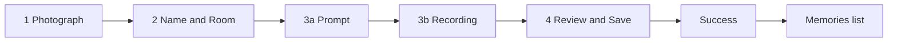
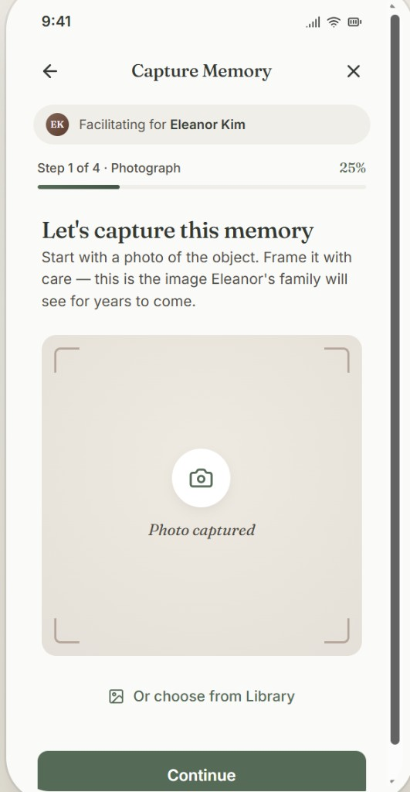
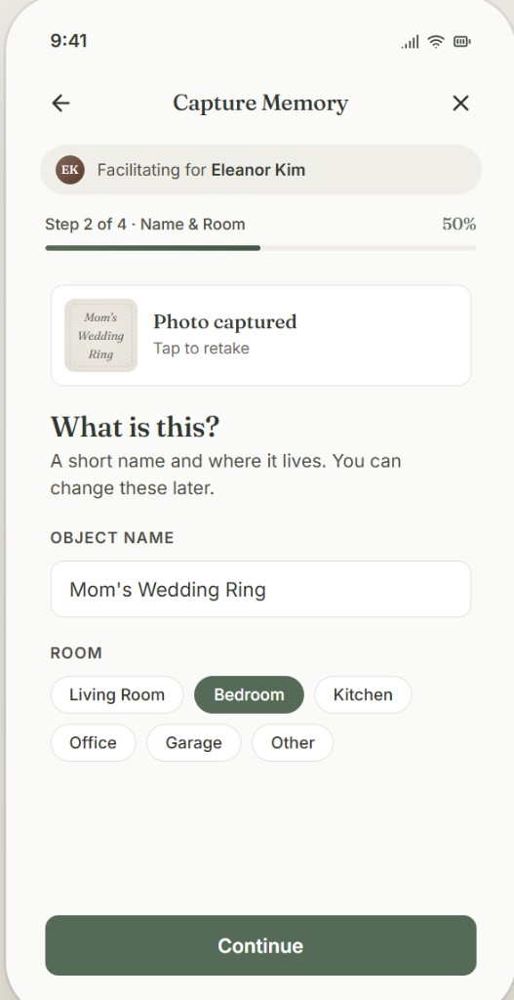
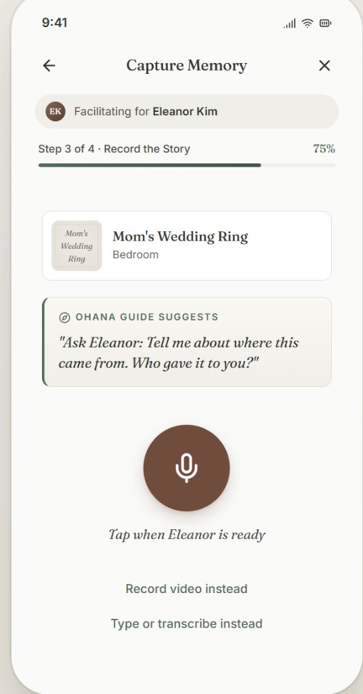
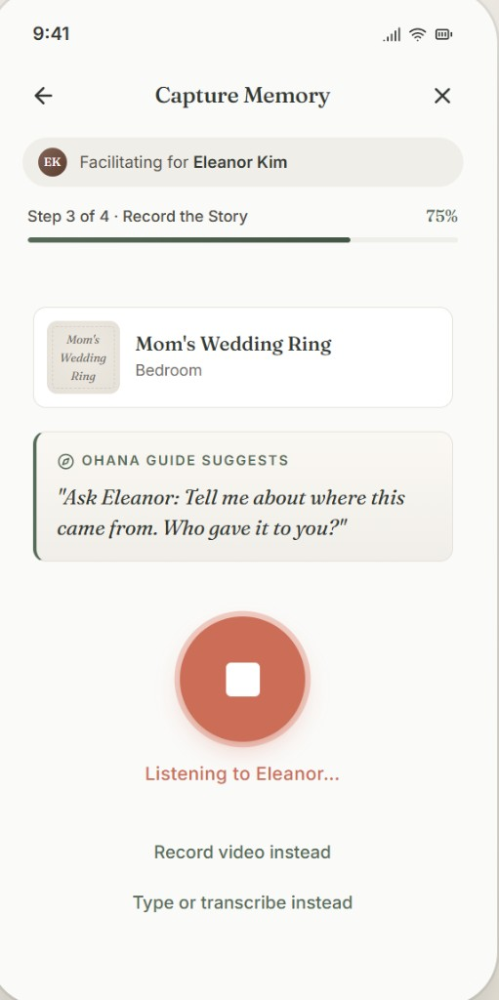
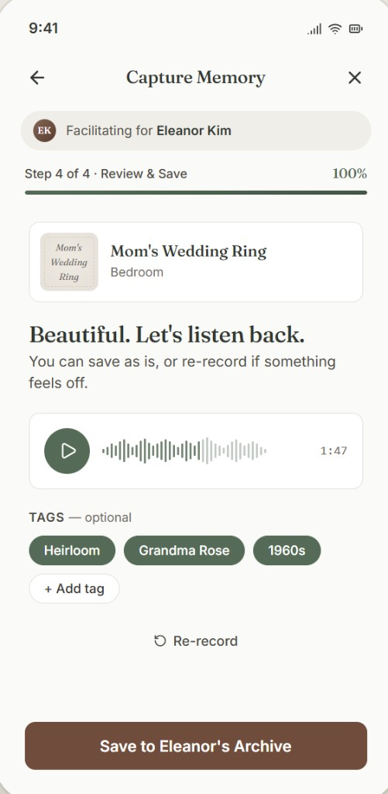
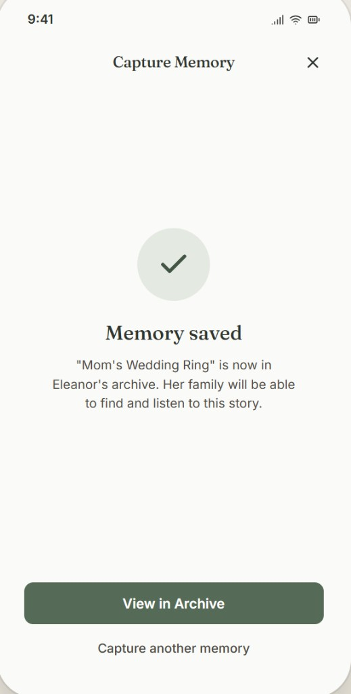
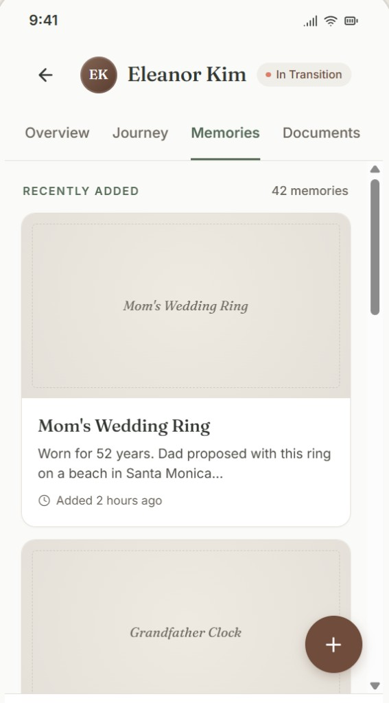

# Memories — user workflow (hi-fi + wireframe reference)

## Document control

| Field | Value |
| --- | --- |
| **Purpose** | Single place for **capture → save → list** flow: screenshots, flow diagram, and low-fi layout notes. |
| **Used by** | [product-requirements-v1.md](product-requirements-v1.md), [technical-design-v1.md](technical-design-v1.md), [design-wireframe-v1.md](design-wireframe-v1.md) |
| **Screenshots** | `docs/assets/workflow-screenshots/*.png` (7 steps, committed to repo) |
| **Last updated** | 2026-04-30 |
| **Routing (web)** | **TanStack Router**; capture = one path + **`?step=`** (see below); canonical detail in [technical-design-v1.md](technical-design-v1.md) §3.1 |

---

## Flow overview (mermaid)



**Context bar (all capture steps):** “Facilitating for [Client]” — Guide-led capture for an elder; aligns with handoff and PRD `ClientAccess` / facilitator model.

### Web routes (`?step=`)

Implementation uses a **single capture URL** with a query parameter so refresh and deep links preserve the step. `:clientId` is the client UUID (or stable id) from context.

| Where you are in the flow | Path (logical) |
| --- | --- |
| Memories list (FAB) | `/clients/:clientId/memories` |
| Photograph | `/clients/:clientId/capture?step=photo` |
| Name and room | `/clients/:clientId/capture?step=meta` |
| Story prompt (before record) | `/clients/:clientId/capture?step=prompt` |
| Recording | `/clients/:clientId/capture?step=record` |
| Review and save | `/clients/:clientId/capture?step=review` |
| Success | `/clients/:clientId/capture?step=done` |

REST APIs for each step are listed in [technical-design-v1.md](technical-design-v1.md) §3.1 (`/api/v1/...`).

---

## Step-by-step (hi-fi screenshots)

Paths are relative to this file (`docs/`).

### 1 — Photograph (Step 1 of 4) — `?step=photo`



- Header: back, title **Capture Memory**, close.
- Progress: **Step 1 of 4 · Photograph**, ~25%.
- Primary: camera / viewfinder area; optional **Choose from Library**.
- Primary CTA: **Continue**.

### 2 — Name and room (Step 2 of 4) — `?step=meta`



- Photo thumbnail + retake.
- **Object name** (required); **Room** chips (**required** in Guide flow; **optional** in consumer / family capture per PRD **FR-007**).
- CTA: **Continue**.

### 3a — Story prompt (Step 3 of 4, before record) — `?step=prompt`



- Memory summary card (title + room).
- **Ohana Guide suggests** — warm question for facilitator to ask elder (maps to **FR-015**).
- Mic CTA + alternates: record video / type or transcribe.

### 3b — Recording (Step 3 of 4, active) — `?step=record`



- Stop control; status (e.g. “Listening to …”).
- Same prompt card for context.

### 4 — Review and save (Step 4 of 4) — `?step=review`



- Progress 100%; playback + **Re-record**.
- Optional **Tags** (chips + add).
- CTA: **Save to [Client]'s Archive** — idempotent save / offline queue per **FR-013**, **FR-014**.

### 5 — Success — `?step=done`



- Confirmation + **View in Archive** / **Capture another memory**.

### 6 — Memories list (client context) — `/clients/:clientId/memories`



- Client header + tabs; **Memories** active; cards (thumbnail, title, snippet, “Added …”).
- FAB **+** for new capture (**FR-010** pagination / counts as in TDD).

---

## Low-fi wireframe (ASCII) — same flow

Use for quick reviews when PNGs are not open. Boxes = major regions, not pixel-accurate.

```
┌─────────────────────────────┐  ┌─────────────────────────────┐
│ < Capture Memory        X │  │ < Capture Memory        X │
│ [ Facilitating for … ]    │  │ [ Facilitating for … ]    │
│ Step 1/4 · Photo   25%    │  │ Step 2/4 · Name    50%    │
│ [====···············]     │  │ [========···········]     │
│                             │  │ [ thumb ] Photo · Retake │
│  Let's capture…            │  │ What is this?            │
│  [   camera / preview   ]  │  │ [ Object name________ ]  │
│  Or choose from Library     │  │ ROOM: [Living][Bed]…     │
│ [      Continue         ] │  │ [      Continue         ] │
└─────────────────────────────┘  └─────────────────────────────┘

┌─────────────────────────────┐  ┌─────────────────────────────┐
│ Step 3/4 · Story    75%     │  │ Step 3/4 · recording        │
│ [ summary card ]            │  │ [ summary ] [ prompt box ] │
│ ┌ Ohana Guide suggests ─┐  │  │        ( STOP )           │
│ │  “Ask …”              │  │  │   Listening…            │ │
│ └────────────────────────┘  │  │  video | type instead   │ │
│        ( MIC )              │  └─────────────────────────────┘
│  Tap when ready…            │
└─────────────────────────────┘

┌─────────────────────────────┐  ┌─────────────────────────────┐
│ Step 4/4 · Review   100%    │  │ ✓ Memory saved            │
│ [ summary ]                 │  │ …in archive…              │
│ Play · waveform · Re-record │  │ [ View in Archive      ]  │
│ TAGS optional · +Add        │  │ Capture another memory    │
│ [ Save to … Archive      ]  │  └─────────────────────────────┘
└─────────────────────────────┘

┌─────────────────────────────┐
│ <  [EK] Eleanor Kim  …      │
│ Overview | Journey | Mem* │
│ RECENTLY ADDED    42 mem   │
│ ┌─────────────────────────┐│
│ │ [thumb] Title… snippet  ││
│ └─────────────────────────┘│
│                        ( + )│
└─────────────────────────────┘
```

---

## PRD / TDD trace (quick)

| UI step | PRD (examples) | TDD §3.1 (v1.1) |
| --- | --- | --- |
| Photo / library | **FR-005**, **FR-011** | `?step=photo` → `POST /api/v1/uploads/images/sign` + PUT; IndexedDB draft |
| Name / room | **FR-007** | `?step=meta`; client-only draft until finalize |
| Prompt | **FR-015** | `?step=prompt` → `POST /api/v1/memories/suggest_prompt` |
| Record / playback | **FR-006**, **FR-008**, **FR-009** | `?step=record` → audio sign + PUT; transcript poll on detail |
| Review / tags | **FR-016**, **FR-017** (phased) | `?step=review` → `POST /api/v1/memories` |
| Save | **FR-013**, **FR-014**, **FR-019** | Idempotency key; offline queue; audit |
| Success | **FR-002** | `?step=done`; optional `GET /api/v1/memories/:id` |
| List | **FR-010**, **FR-012** | `GET /api/v1/clients/:clientId/memories?cursor=` |
| Simplicity | **NFR-012** | [design-wireframe-v1.md](design-wireframe-v1.md); copy and touch targets |

---

## Related work

1. **Technical design:** **[technical-design-v1.md](technical-design-v1.md)** §3.1 — keep routes and APIs in sync when the flow changes.  
2. **Wireframes:** supplementary states in **[design-wireframe-v1.md](design-wireframe-v1.md)**; this doc stays the **hi-fi** reference.

Screenshots live under `docs/assets/workflow-screenshots/` as committed files.
