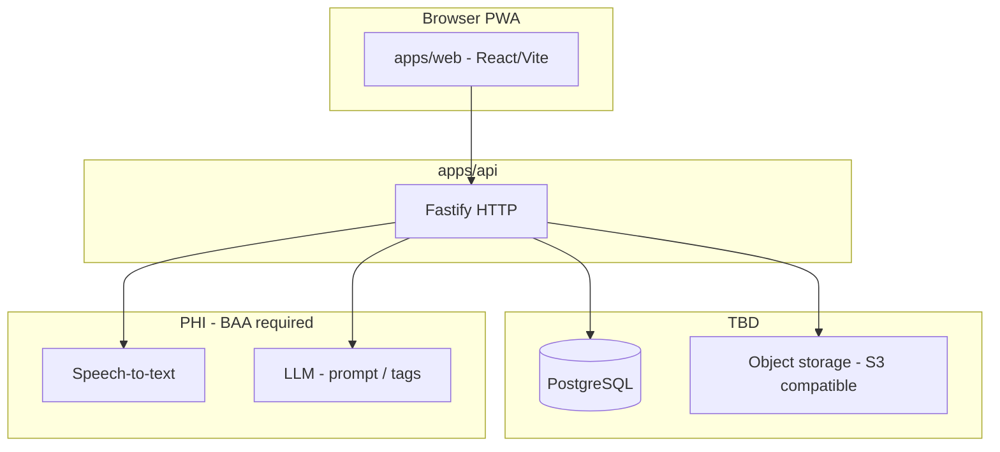

# Memories — technical design

## Document control

| Field | Value |
| --- | --- |
| **Author** | Ken Levy |
| **Engineering owner** | TBD |
| **Status** | Draft |
| **Version** | 1.0 |
| **Edition** | **v1** — filename `technical-design-v1.md` (use `-v2.md` etc. for major rewrites) |
| **Last updated** | 2026-04-22 |
| **Template used** | `docs/templates/technical-design-template.md` (structure); content scoped to Memories |
| **Related PRD** | [product-requirements-v1.md](product-requirements-v1.md) v1.0 |
| **Related docs** | [memories-user-workflow-v1.md](memories-user-workflow-v1.md); [design-wireframe-v1.md](design-wireframe-v1.md); [tech-stack.md](tech-stack.md); [implementation-log.md](implementation-log.md); [adr/README.md](adr/README.md); [Prototype Backend Engineering Handoff.md](Prototype%20Backend%20Engineering%20Handoff.md) |

---

## 1. Summary

- **Objective:** Implement the **Memories** vertical (web + API + `@memories/shared`) for multimodal memories—capture, storage, list/detail, async transcription, facilitator context, and pilot-aligned resilience—per PRD **FR-001**–**FR-019** and **NFR-001**–**NFR-012**.
- **Non-goals (technical):** Full Ohana Way shell (G1/G6/G4 UI), practice billing, messaging, AI Guide chat backend—unless explicitly merged; native apps.
- **Current codebase:** `apps/api` exposes **`GET /health`** only; `apps/web` is a splash screen. Routes and tables below are **targets** for implementation, not existing endpoints.

---

## 2. Context

**Identity:** JWT/session claims (`practice_id`, `user_id`, `client_id`, roles) from platform or this service—**open** (PRD open question #1). All memory APIs must enforce **tenant + client access** (**FR-012**).

---

## 3. UI workflow (screen → route → API)

**Hi-fi reference:** step screenshots, mermaid, ASCII, and PRD trace table in **[memories-user-workflow-v1.md](memories-user-workflow-v1.md)**.

**Wireframe reference (empty/error/offline):** **[design-wireframe-v1.md](design-wireframe-v1.md)**.

### 3.1 Step table (implementation target)

| Step | Screen ID (wireframe) | User-visible step | Proposed web route (TBD) | Proposed API / integration (TBD) | PRD |
| --- | --- | --- | --- | --- | --- |
| 0 | **ML1** | Client **Memories** tab (list + FAB) | `GET /clients/:clientId/memories` view or `/c/:clientId/memories` | `GET /api/clients/:clientId/memories?cursor=` (cursor pagination **FR-010**) | **FR-010**, **FR-012** |
| 1 | **MC1** | Photograph | `/clients/:clientId/capture` step `photo` | `POST /api/uploads/images/sign` → direct PUT to object storage; local IndexedDB draft id | **FR-005**, **FR-011**, **FR-014** |
| 2 | **MC2** | Name & room | same route, step `meta` | PATCH draft or hold in client until **POST /api/memories** finalize | **FR-007** |
| 3a | **MC3** | Story prompt (pre-record) | step `prompt` | `POST /api/memories/suggest_prompt` (handoff Section 6.2); fallback copy on error | **FR-015**, **NFR-005**, **NFR-009** |
| 3b | **MC4** | Recording | step `record` | Client `MediaRecorder`; audio blob → `POST /api/uploads/audio/sign` → PUT; optional websocket **not** MVP | **FR-006**, **FR-014** |
| 4 | **MC5** | Review & save | step `review` | `POST /api/memories` idempotent (**FR-013**) body: client_id, keys, metadata, tag selections; server creates `memory_id`, enqueues STT | **FR-008**, **FR-009**, **FR-016**, **FR-019** |
| 5 | **MC6** | Success | step `done` (same capture route or `/…/done`) | Optional `GET /api/memories/:id` prefetch | **FR-002** |
| 6 | **ML1** | Return to list | navigate to list route | `GET` list; reflect new card | **FR-010** |

**Global chrome (all MC\*):** facilitator strip (“Facilitating for …”) = resolved from auth context + `clientId`; no PII in analytics payloads (**NFR-006**, handoff Section 10.3).

**Route naming:** Final paths may use TanStack Router / React Router prefix `/(app)/...`; table uses logical segments. **Single-page stepper** vs separate routes is an implementation choice—document in §9 when decided.

---

## 4. Requirements traceability (Memories)

| PRD ID | Design coverage |
| --- | --- |
| **FR-001**–**FR-004** | §3.1 create/view/update/delete; §6 authz middleware on memory routes |
| **FR-005**–**FR-007** | §3.1 upload + metadata; §5 `Memory` + `MemoryMedia` + text fields |
| **FR-008**–**FR-009** | §5 transcript job; §7 worker callback; client poll or SSE **TBD** |
| **FR-010** | §3.1 list cursor; §5 indexes |
| **FR-011** | §7 validation + client resize policy |
| **FR-012** | §2 identity; §6 authorization; RLS policies **TBD** if Postgres RLS |
| **FR-013**–**FR-014** | §7 idempotency keys; §8 offline queue contract (service worker + IndexedDB) |
| **FR-015** | §3.1 suggest_prompt; §7 Anthropic integration, redaction |
| **FR-016**–**FR-018** | §5 tags + visibility enum |
| **FR-019** | §7 audit sink append-only |
| **NFR-001**–**NFR-010** | §7 infra, logging, observability, alerts |
| **NFR-011** | [AGENTS.md](../AGENTS.md) coverage targets; CI gates |
| **NFR-012** | [design-wireframe-v1.md](design-wireframe-v1.md) density + component guidelines for eng |

---

## 5. Data model (sketch)

Align with handoff Section 4.2 (entity names may vary in migration naming):

- **`practices`**, **`users`**, **`clients`**, **`client_access`** — tenant and RBAC (if this service is system of record).
- **`memories`**: `id`, `client_id`, `practice_id`, title/name, room, optional body, `sharing_visibility`, timestamps, soft-delete.
- **`memory_media`**: `memory_id`, `type` (image|audio|…), `storage_key`, `sort_order`, mime, byte_size.
- **`memory_transcripts`**: `memory_id`, `text`, `status` (pending|ready|failed), `confidence`, vendor refs.
- **`memory_tags`**, **`memory_reactions`**, **`memory_comments`** — phased per **FR-016**, **FR-017**.

**Transcript job:** queue table or external worker; STT vendor per **NFR-007** / PRD open questions.

---

## 6. Components (repos)

| Component | Responsibility |
| --- | --- |
| **`apps/web`** | Capture stepper, list, facilitator chrome, offline queue, signed upload client (**FR-014**, **NFR-012**) |
| **`apps/api`** | Authz, signed URLs, memory CRUD, idempotent create, enqueue STT, suggest_prompt proxy |
| **`packages/shared`** | Zod contracts for API + shared constants |

---

## 7. Security, privacy, logging

- **TLS** end-to-end (**NFR-001**); object access via **short-lived signed URLs** (**NFR-002**).
- **Logs:** structured JSON; **metadata only**—no transcript text, names in URLs, or base64 media (**NFR-006**).
- **AI calls:** minimum necessary fields; delimiter wrapping for user content; zero-retention endpoint per vendor contract (**NFR-009**).
- **Audit:** memory PHI writes to append-only store (**FR-019**, **NFR-008**).

---

## 8. Offline capture (engineering notes)

Per handoff Sections 2.5 and 5.1:

- Client maintains **working memory** in **IndexedDB** (draft id, photo blob ref, audio blob ref, metadata) until **POST /api/memories** succeeds.
- **Retries:** exponential backoff, up to **24h** window (product); **Background Sync** where supported + foreground retry when app opens.
- **Idempotency:** `Idempotency-Key` header (or client-generated UUID in body) on create to satisfy **FR-013**.

---

## 9. Open decisions (technical)

| Topic | Options | Note |
| --- | --- | --- |
| Router | TanStack Router vs React Router | [tech-stack.md](tech-stack.md) open until locked |
| Stepper routing | Query `?step=` vs nested routes vs state-only | UX deep-link preference |
| Realtime | Poll transcript status vs SSE | PRD allows async |
| RLS | Postgres RLS vs app-only checks | Tied to PRD open question #1 |

---

## 10. Rollout

- Feature flags for STT and AI prompt in non-prod.
- Synthetic PHI **only** outside production until BAAs signed (**NFR-007**).

---

## Revision

| Version | Date | Summary |
| --- | --- | --- |
| 0.1 | 2026-04-22 | Initial TDD: UI workflow map, traceability, data sketch, offline/security notes |
| 1.0 / file v1 | 2026-04-22 | Renamed to `technical-design-v1.md`; doc version 1.0 |
