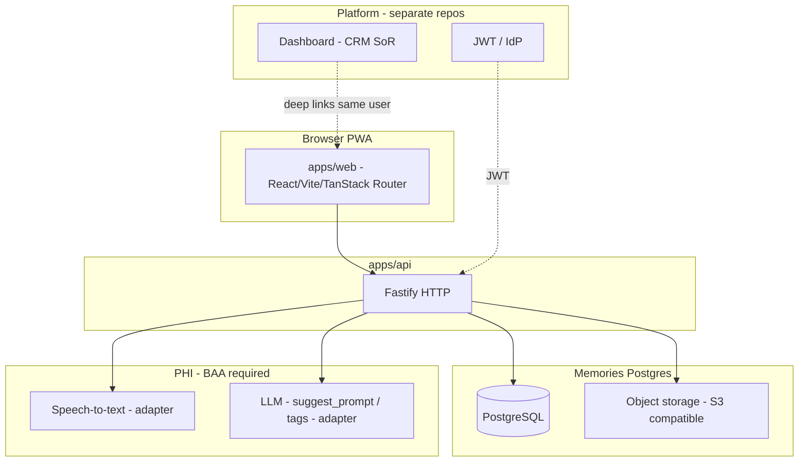

# Memories — technical design

## Document control

| Field | Value |
| --- | --- |
| **Author** | Ken Levy |
| **Engineering owner** | Ken Levy |
| **Status** | Approved |
| **Version** | 1.1 |
| **Edition** | **v1** — filename `technical-design-v1.md` (use `-v2.md` etc. for major rewrites) |
| **Last updated** | 2026-04-30 |
| **Template used** | `docs/templates/technical-design-template.md` (structure); content scoped to Memories |
| **Related PRD** | [product-requirements-v1.md](product-requirements-v1.md) v1.0 |
| **Related docs** | [memories-user-workflow-v1.md](memories-user-workflow-v1.md); [design-wireframe-v1.md](design-wireframe-v1.md); [tech-stack.md](tech-stack.md); [implementation-log.md](implementation-log.md); [adr/README.md](adr/README.md); [ADR-20260430-memories-platform-boundary-auth-routing.md](adr/ADR-20260430-memories-platform-boundary-auth-routing.md); [Prototype Backend Engineering Handoff.md](Prototype%20Backend%20Engineering%20Handoff.md) |

---

## 1. Summary

- **Objective:** Implement the **Memories** vertical (web + API + `@memories/shared`) for multimodal memories—capture, storage, list/detail, async transcription, facilitator context, and pilot-aligned resilience—per PRD **FR-001**–**FR-019** and **NFR-001**–**NFR-012**.
- **Non-goals (technical):** Full Ohana Way shell (G1/G6/G4 UI), practice billing, messaging, AI Guide chat backend—unless explicitly merged; native apps.
- **Current codebase:** `apps/api` exposes **`GET /health`** only; `apps/web` is a splash screen. Routes and tables below are **targets** for implementation, not existing endpoints.
- **Decision baseline:** [ADR-20260430-memories-platform-boundary-auth-routing.md](adr/ADR-20260430-memories-platform-boundary-auth-routing.md) (**Accepted**, Ken Levy sign-off).

---

## 2. Context

**Identity:** **Platform-issued JWT** verified by `apps/api` (JWKS or equivalent). Claims must support **tenant + client authorization** (e.g. `practice_id`, `user_id`, roles, and client scope as agreed with the Dashboard team). Memories **does not** own IdP for this slice.

**System of record:** **Platform** owns Practice / User / Client / `ClientAccess`. **Memories** owns **memory domain tables**, **job rows**, and **memory mutation audit** in this service’s PostgreSQL. Cross-check [ADR-20260430-memories-platform-boundary-auth-routing.md](adr/ADR-20260430-memories-platform-boundary-auth-routing.md).

**Authorization:** **Application-layer** enforcement on every memory route and query (practice boundary + `ClientAccess` analog). **No Postgres RLS in v1**; revisit if additional DB writers or direct SQL access appear.

All memory APIs must enforce **tenant + client access** (**FR-012**).

---

## 3. UI workflow (screen → route → API)

**Hi-fi reference:** step screenshots, mermaid, ASCII, and PRD trace table in **[memories-user-workflow-v1.md](memories-user-workflow-v1.md)**.

**Wireframe reference (empty/error/offline):** **[design-wireframe-v1.md](design-wireframe-v1.md)**.

**Web stack:** **TanStack Router**. Optional layout prefix (e.g. `/(app)/`) is an implementation detail; logical paths below are canonical.

### 3.1 Step table (implementation target)

| Step | Screen ID (wireframe) | User-visible step | Web route (logical) | API / integration | PRD |
| --- | --- | --- | --- | --- | --- |
| 0 | **ML1** | Client **Memories** tab (list + FAB) | `GET /clients/:clientId/memories` | `GET /api/v1/clients/:clientId/memories?cursor=` (cursor pagination **FR-010**) | **FR-010**, **FR-012** |
| 1 | **MC1** | Photograph | `/clients/:clientId/capture?step=photo` | `POST /api/v1/uploads/images/sign` → client **PUT** to object storage; draft in **IndexedDB** | **FR-005**, **FR-011**, **FR-014** |
| 2 | **MC2** | Name & room | `?step=meta` | Draft stays **client-only** until finalize; **Guide** requires room, **consumer** optional (PRD) | **FR-007** |
| 3a | **MC3** | Story prompt (pre-record) | `?step=prompt` | `POST /api/v1/memories/suggest_prompt` (handoff §6.2); **~1.8s timeout** + static fallback | **FR-015**, **NFR-005**, **NFR-009** |
| 3b | **MC4** | Recording | `?step=record` | `MediaRecorder`; `POST /api/v1/uploads/audio/sign` → **PUT**; websocket **not** MVP | **FR-006**, **FR-014** |
| 4 | **MC5** | Review & save | `?step=review` | `POST /api/v1/memories` idempotent (**FR-013**): keys, metadata, tags; server assigns `memory_id`, enqueues STT job | **FR-008**, **FR-009**, **FR-016**, **FR-019** |
| 5 | **MC6** | Success | `?step=done` | Optional `GET /api/v1/memories/:id` prefetch | **FR-002** |
| 6 | **ML1** | Return to list | navigate to list route | `GET` list | **FR-010** |

**Global chrome (all MC\*):** facilitator strip (“Facilitating for …”) from auth context + `clientId`; no PII in analytics payloads (**NFR-006**, handoff §10.3).

**Errors:** JSON body `{ code, message, request_id }` on 4xx/5xx; correlation id on every request (**NFR-006**).

---

## 4. Requirements traceability (Memories)

| PRD ID | Design coverage |
| --- | --- |
| **FR-001**–**FR-004** | §3.1 create/view/update/delete; §6 authz middleware on memory routes; Appendix A matrix |
| **FR-005**–**FR-007** | §3.1 upload + metadata; §5 `Memory` + `MemoryMedia` + text fields; room rules in §3.1 |
| **FR-008**–**FR-009** | §5 transcript job + worker; **client poll** for status on detail / pending UI (SSE optional later) |
| **FR-010** | §3.1 list cursor; §5 indexes |
| **FR-011** | §7 validation + client resize policy |
| **FR-012** | §2 identity; §6 **app-layer** authorization (no RLS v1); Appendix A |
| **FR-013**–**FR-014** | §7 idempotency keys; §8 offline queue (IndexedDB); no server draft PATCH v1 |
| **FR-015** | §3.1 suggest_prompt; §7 LLM adapter + timeout + fallback (**NFR-009**) |
| **FR-016**–**FR-018** | §5 tags + visibility enum |
| **FR-019** | §7 audit: Postgres append-only `audit_events` (metadata only) |
| **NFR-001**–**NFR-010** | §7 infra, logging, observability, alerts |
| **NFR-003** | **SLOs (v1 targets):** non-AI read APIs **p95 < 500 ms** under nominal load (excludes cold start); `suggest_prompt` bounded by **~1.8s** server timeout; STT remains async per PRD |
| **NFR-011** | [AGENTS.md](../AGENTS.md) coverage targets; CI gates |
| **NFR-012** | [design-wireframe-v1.md](design-wireframe-v1.md) density + component guidelines for eng |

---

## 5. Data model (sketch)

Align with handoff Section 4.2 (migration naming may differ):

- **`memories`**: `id`, `client_id`, `practice_id`, title/name, room (nullable when consumer path), optional body, `sharing_visibility`, timestamps, soft-delete.
- **`memory_media`**: `memory_id`, `type` (image|audio|…), `storage_key`, `sort_order`, mime, byte_size.
- **`memory_transcripts`**: `memory_id`, `text`, `status` (pending|ready|failed), `confidence`, vendor refs.
- **`transcription_jobs`** (or equivalent): durable queue state for worker; `pending` → `processing` → terminal; links to `memory_id` / media row.
- **`memory_tags`**, **`memory_reactions`**, **`memory_comments`** — phased per **FR-016**, **FR-017**.
- **`audit_events`** (append-only): memory PHI writes (**FR-019**); **no** transcript or media payload in rows.

**Not stored as first-class SoR in Memories v1:** full **`practices` / `users` / `clients` / `client_access`** replicas—use JWT-validated IDs and platform sync only if a minimal scope table is required (see ADR).

**Object keys (S3-compatible):** `{practice_id}/{memory_id}/{media_id}` (refine in schema/ops docs if bucket layout requires a prefix).

**STT / LLM:** vendor implementations behind **adapters**; production vendors **BAA-gated** (**NFR-007**).

---

## 6. Components (repos)

| Component | Responsibility |
| --- | --- |
| **`apps/web`** | TanStack Router; capture stepper (`?step=`); list; facilitator chrome; offline queue; signed upload client (**FR-014**, **NFR-012**) |
| **`apps/api`** | JWT verification; authz; signed URLs; memory CRUD; idempotent create; enqueue STT; `suggest_prompt` proxy; worker entrypoints as needed |
| **`packages/shared`** | Zod contracts for API + shared constants |

---

## 7. Security, privacy, logging

- **TLS** end-to-end (**NFR-001**); object access via **short-lived signed URLs** (**NFR-002**).
- **Logs:** structured JSON; **metadata only**—no transcript text, names in URLs, or base64 media (**NFR-006**).
- **AI calls:** minimum necessary fields; delimiter wrapping for user content; **zero-retention** or equivalent per vendor contract (**NFR-009**); **stub** LLM in non-prod when keys absent.
- **Audit:** memory PHI writes to **append-only Postgres** `audit_events` (and optional future SIEM mirror) (**FR-019**, **NFR-008**).

---

## 8. Offline capture (engineering notes)

Per handoff Sections 2.5 and 5.1:

- Client maintains **working memory** in **IndexedDB** (draft id, photo blob ref, audio blob ref, metadata) until **`POST /api/v1/memories`** succeeds. **No** server draft PATCH in v1.
- **Retries:** exponential backoff, up to **24h** window (product); **Background Sync** where supported + foreground retry when app opens.
- **Idempotency:** `Idempotency-Key` header (or client-generated UUID in body) on create (**FR-013**).

---

## 9. Resolved decisions (technical)

Authoritative narrative: [ADR-20260430-memories-platform-boundary-auth-routing.md](adr/ADR-20260430-memories-platform-boundary-auth-routing.md).

| Topic | Resolution |
| --- | --- |
| Router | **TanStack Router** |
| Stepper routing | **Single capture route + `?step=`** (`photo` \| `meta` \| `prompt` \| `record` \| `review` \| `done`) |
| Transcript updates to client | **Poll** on detail / pending UI for v1; SSE optional later |
| RLS | **App-layer authz v1**; RLS when justified by new DB access patterns |
| ORM | **Drizzle** |
| Draft lifecycle | **IndexedDB only** until idempotent finalize `POST` |
| Jobs | **Postgres job rows** + worker |
| API prefix | **`/api/v1/`** |

---

## 10. Rollout

- Feature flags for STT and AI prompt in non-prod.
- Synthetic PHI **only** outside production until BAAs signed (**NFR-007**).

---

## 11. Appendix A — Memory-relevant permissions (MVP)

Source: handoff **§7.2** (indicative; product may refine). **Guide notes / messages** are out of scope for this repo but inform platform auth.

| Action | Guide (primary) | Guide (support) | Family (primary) | Family (member) |
| --- | --- | --- | --- | --- |
| View all memories | ✓ | ✓ | ✓ (by visibility) | ✓ (by visibility) |
| Create memory | ✓ | ✓ | — | — |
| Edit memory (name, tags) | ✓ | ✓ | ✓ (own comments) | ✓ (own comments) |
| Delete memory | ✓ | — | — | — |

Enforcement: **application code** + tests; must match platform `ClientAccess` semantics when claims are sourced from the Dashboard.

---

## Revision

| Version | Date | Summary |
| --- | --- | --- |
| 0.1 | 2026-04-22 | Initial TDD: UI workflow map, traceability, data sketch, offline/security notes |
| 1.0 / file v1 | 2026-04-22 | Renamed to `technical-design-v1.md`; doc version 1.0 |
| 1.1 | 2026-04-30 | Approved; locked routes, SoR split, JWT, poll, Drizzle, job queue, appendix matrix; ADR-20260430 |
