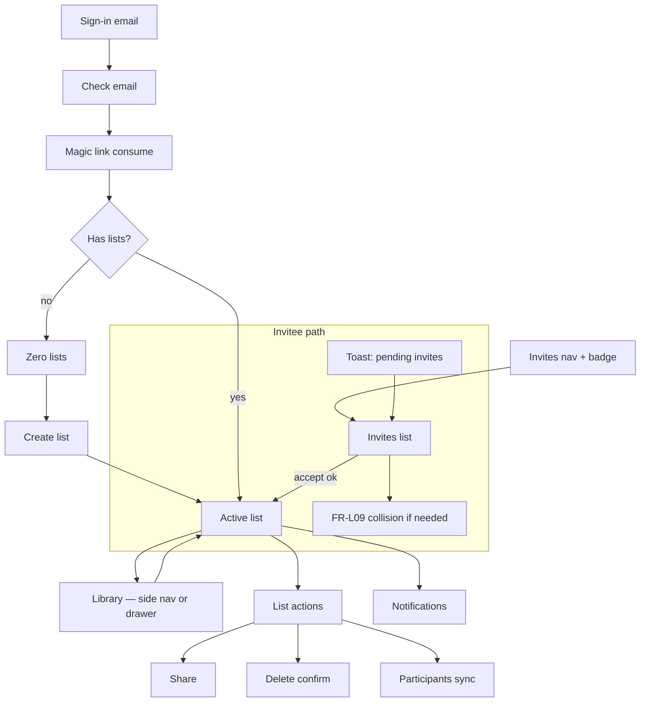

# Multi-list web app — design wireframes

## Document control

| Field | Value |
| --- | --- |
| Title | Multi-list web app — wireframes |
| Version | 0.50 |
| Date | 2026-04-17 |
| Author | Draft (from PRD v0.28 + TDD v0.24) |
| PRD | [product-requirements.md](product-requirements.md) v0.28 |
| TDD | [technical-design.md](technical-design.md) v0.24 |
| Dev plan | [development-plan.md](development-plan.md) v1.13 |
| v1.1 PRD (invite email) | [product-requirements-v1.1.md](product-requirements-v1.1.md) **FR-V11-S01** |
| Fidelity | Annotated low-fi |

---

## Summary

Wireframes cover **responsive web**: **desktop** uses a **persistent side nav** for the list library; **narrow viewports** use a **drawer / full-screen picker** with the same library content (**M1**). **Magic-link auth**, **zero-list** onboarding, **Private / Shared** and sync roster (**FR-L11**, **FR-L12**), **active list** with items and **order mode**, **share**, **FR-S16** invite discovery (with **design-review mitigations**: compact toast, **Invites** entry point, **notification priority matrix**), **FR-L09** collision UI, **list delete** + **30s undo** (**FR-L08**), **notifications** with **bell badge** and **mark all read**, **list rename via modal** (with **discoverability** affordances), **no undo for item delete** (MVP — **confirm recommended**), and **FR-S10** / participant actions. Patterns follow **NFR-04** (with **modal/focus** notes in **Design review recommendations**). A consolidated **Design review recommendations** section captures expert UX/UI, a11y, and copy guidance for handoff.

---

## Assumptions

- **Platform:** Responsive browser (phone + desktop); touch targets and breakpoints per full PRD later (**NFR-03**).
- **Layout:** **Wide viewports:** **left side navigation** = list library (**M1**); **main column** = **L1**. **Narrow viewports:** library opens as **drawer** or full-screen overlay (same **M1** UI), not a second desktop pattern.
- **Auth:** Email **magic links** only in MVP (TDD); no password fields.
- **Realtime:** **SSE** when available; until then, refetch on focus / pull-to-refresh / optional short poll on open sync list (TDD risk mitigation).
- **Notifications:** **N1** (bell / **FR-S10**) stays **in-app** only — no email/SMS/push for that feed (**NFR-06**). **v1.1** adds **transactional** **list-invite** email (optional; magic-link class) so invitees can open an accept URL from their inbox — **FR-V11-S01** in [product-requirements-v1.1.md](product-requirements-v1.1.md); wireframes for **FR-S16** (toast + **T4**) remain the primary in-app path once signed in.
- **Implementation stack:** UI patterns below assume [tech-stack.md](tech-stack.md) (**React**, **Vite**, **TanStack Query**, **EventSource** / **SSE**, **Radix** and/or **React Aria**, **Zod**, **Playwright**).

---

## Implementation alignment ([tech-stack.md](tech-stack.md))

Expert suggestions **narrowed** to the locked frontend stack (not generic design theory).

| Topic | Guidance |
| --- | --- |
| **Motion** | Prefer **lightweight** transitions (CSS or Radix **Presence**). Keep **checkbox / done**, **add item**, and **dialog** open/close feeling **snappy** (target **&lt;150ms** perceived); defer heavy reorder animation until **custom order** interaction is stable. |
| **Server state** | **TanStack Query:** align query keys and **invalidation** with **M1**, **L1**, **T4**, **N1** (see tech-stack *Frontend ↔ wireframes*). **Stale sync on L1:** rely on **SSE** + **invalidate/patch**; when SSE is off, use **refetchOnWindowFocus** / optional **refetchInterval** + wireframe copy (*Design risks* §4). |
| **Optimistic UI** | **`useMutation` `onMutate`:** reasonable for **toggle done** and **add item** after UX review. **Item delete** (no undo) and **list delete** / **T1** stay **pessimistic** or **confirm-first**. |
| **Toasts** | One app-wide provider (**Sonner** or **Radix Toast** per tech-stack); implement **4-max stack** + queue (*Design risks* §1). |
| **Dialogs** | **Radix / React Aria** for **M2**, **T1–T4**, **T3** (**FR-L09** variant with **outside click = pending**). |
| **Forms & limits** | **Zod** (shared rules with API): show **remaining code points** (e.g. near **50** max) on list name and item fields when user is close to the limit. |
| **T2 — trust** | Before **Send invites**, add a **one-line recap** of mode (**Duplicate** vs **Sync**) + invitee count so wrong-mode mistakes drop. |
| **After accept (duplicate)** | Success **toast**: copy is **yours** and **won’t sync** with the sender — closes the mental model gap (**FR-S01**). |
| **T4 / N1 empty** | **T4:** *“You’re caught up”* + link to **Help** (72h). **N1:** distinguish **“No notifications yet”** vs **“All caught up (read)”** if filters exist. |
| **A1 email field** | **`autocomplete="email"`**, **`spellcheck={false}`**, clear validation errors for malformed addresses (magic-link flow). |
| **M1 at scale** | When **pagination** or large libraries land, consider **virtualized** list in nav (e.g. **TanStack Virtual** — optional add to tech-stack) or **sections** (pinned / recent) before search feels mandatory. |
| **T2 many emails** | **Invitees** section only: one validated email field per row plus **+ Add another email**; **no** separate bulk **Paste emails** field (avoids two competing entry points). |
| **Icons** | **Private** / **Shared** / **Invites** / mode: do not rely on **color alone** (**NFR-04**); pair with text or shape. |
| **Testing** | **Vitest** + **Testing Library:** dialog **focus** and **T3** dismiss semantics. **Playwright:** scenarios in tech-stack *Frontend testing* row. |
| **Feature flags** | Optional: flag **toast stack rules** and **FR-S16** compact behavior for production tuning without a full release. |

---

## Screen inventory

### Catalog (what each surface is for)

| ID | Surface | Purpose |
| --- | --- | --- |
| A1 | Sign-in (email) | Request magic link |
| A2 | Check your email | Link sent; resend cooldown **TBD** |
| A3 | Session bootstrap | Consume magic-link token (redirect / minimal page) |
| S0 | Zero lists | First list only (**FR-L07**) |
| L1 | Active list | Items, sort, add; share/settings; title → rename modal (**M3** too) |
| M1 | List library | Pick list; Private/Shared (**FR-L11**); actions; optional search |
| INV | Invites (nav) | Route to **T4**; badge if pending (**FR-S16**) |
| M2 | Create list | Name; **FR-L02**–**FR-L04** |
| M3 | List actions | Rename (**FR-L10**), delete (**FR-L08**), share, participants |
| T1 | Delete list confirm | Confirm soft-delete → undo toast |
| T2 | Share list | Duplicate/sync; emails; roles (**FR-S06**, **FR-S12**) |
| T3 | FR-L09 name collision | Rename existing list or Decline invite |
| T4 | Pending invites | All pending; Accept + Decline per row (**FR-S16**) |
| P1 | Participants | Roster (**FR-L12**); leave/remove/reshare |
| N1 | Notifications | Sharer outcomes (**FR-S10**); badge; mark read |

### Navigation (where you come from and go next)

| ID | From | To |
| --- | --- | --- |
| A1 | Unauthenticated landing | A2 |
| A2 | A1 submit | A3 (email) / return |
| A3 | Email link | S0 or library |
| S0 | First login, no lists | L1 |
| L1 | Default after picking a list | T2, T1, rename, N1, P1 |
| M1 | Side nav (desktop) or drawer (mobile) | L1, M2, M3 |
| INV | Side nav / drawer **Invites** | T4 |
| M2 | S0, M1 **+** | M1 / L1 |
| M3 | M1 row **⋯** | T1–T4 |
| T1 | M3 | L1 or M1 |
| T2 | M3 | Toast on success |
| T3 | Accept when name conflicts | Pending or accepted |
| T4 | **INV** or FR-S16 toast **View** | T3 or declined |
| P1 | M3 or L1 | T2, confirms |
| N1 | Header bell | — |

---

## User flow (high level)




---

## Global patterns

- **Chrome:** Top **app bar** — product name, **active list title** (opens **rename list** **modal** — not inline), **visible rename affordance** on title at **hover + keyboard focus** (e.g. pencil icon) — **primary discoverable path** remains **M3 → Rename list** (via sidebar **⋯**). **Invites** (nav row → **T4**, **badge** when pending — complements **FR-S16**), **Notifications** bell with **unread count badge** (N1, **FR-S10**), **Account** menu (sign out **TBD**). List actions (**M3**) are accessed from the sidebar **⋯** only — no actions menu in the header. **Desktop:** **M1** + **Invites** in **left side nav**. **Mobile:** **hamburger** opens **drawer** with **M1** + **Invites** + **Account** **TBD** order.
- **FR-S16 (invite discovery):** **Resolved:** surface on **every in-app navigation** when pending exists. **Design mitigation (fatigue):** use a **compact** toast when the **pending set is unchanged** since last dismiss (e.g. “You have pending invites — **View**”) and the **full** summary when **count or list of invites changed** or on **cold app load**. Always provide **Invites** in nav with **badge** so users are not toast-dependent. **Announce** for screen readers (**NFR-04**). **Stacking** with other toasts: follow **Design review recommendations → Notification & toast priority**.
- **FR-L08 undo:** After delete confirm, **toast** “List deleted” + **Undo** (≤30s). Server tombstone + **`POST /lists/{id}/restore`** (TDD §6); undo works after refresh. **MVP:** Soft-deleted list is **hidden** from **M1** / **`GET /lists`** until restore or purge — **undo is only from the toast** (no second chrome path if user dismisses toast early). Optional **non-dismissible** or **sticky** toast is a later polish unless **FR-L08** is extended.
- **Dialogs & focus (clarify vs PRD wording):** **FR-L09** collision dialog — Escape, outside click, **Cancel** → **pending** (not declined). **Standard modals** (rename, create list, delete confirm, share): use **WCAG-consistent** behavior — **focus moves into** the dialog on open, **Tab** cycles **within** the dialog, **Escape** closes (map to Cancel semantics per dialog). Reconcile any PRD line “do not trap focus” with eng/a11y as **scope** (e.g. applies only to **FR-L09**-style dialogs vs generic chrome) so shipped behavior is not ambiguous (**NFR-04**).
- **Private / Shared:** On every library row (**FR-L11**). **Shared** = sync list with ≥1 other accepted participant; duplicate-only outbound does **not** show participant roster on sharer’s original (**FR-L12** MVP note).
- **Errors:** Inline / toast for validation; **409** collision surfaces T3; **410** expired invite removes from pending without dedicated “expired” toast for invitee (**FR-S05** silent for invitee).

---

## App shell (responsive)

### Desktop — side nav + main

**M1** is always visible in the **left column**; **L1** fills the rest. Bell shows **unread badge** (count).

```
+------------------+-----------------------------------------------+
| [App]            | [List title............]  [🔔 3] [Acct]       |
+------------------+-----------------------------------------------+
| Lists            |  L1 — items, sort, add row…                  |
| > Groceries  Prv |                                               |
|   Hardware Shr   |                                               |
| Invites (2)      |                                               |
| [ + New list ]   |                                               |
+------------------+-----------------------------------------------+
```

### Mobile — drawer for library

Single-column **L1**; **☰** or **Lists** opens **M1** as a **drawer** or full-screen sheet (same rows as desktop nav).

---

## Wireframes

### A1 — Sign-in (email)

**Purpose:** Start magic-link flow.

**Layout (mobile):**

```
+------------------------------------------------------------------+
| My Lists                                                         |
+------------------------------------------------------------------+
|                                                                  |
|  Sign in                                                         |
|  +------------------------------------------------------------+  |
|  | Email address                                              |  |
|  +------------------------------------------------------------+  |
|                                                                  |
|  [ Primary: Send magic link ]                                    |
|                                                                  |
|  [Help] [Privacy — TBD]     ← link row; not primary-task noise   |
+------------------------------------------------------------------+
```

**Annotations:**

- No password field (TDD magic links).
- **[NFR-04]** Label email field; submit via keyboard; visible focus.
- **FR-S05 (72h invites):** Put **“Invites expire after 72 hours”** in **Help**, **T4** empty/footer, or **share** flows — **not** prominent on **A1** (disconnects from sign-in task).

---

### S0 — Zero lists

**Purpose:** **FR-L07** — primary job is creating the first list; **invitees with no lists yet** must still reach **T4**.

**Layout:**

```
+------------------------------------------------------------------+
| [☰]  [App]              [Invites 2] [🔔] [Account]   ← if pending |
+------------------------------------------------------------------+
|                                                                  |
|         You don't have any lists yet.                            |
|                                                                  |
|         [ Primary: Create your first list ]                      |
|         [ Secondary: View pending invites ]  ← when pending > 0  |
|                                                                  |
+------------------------------------------------------------------+
```

**Annotations:**

- **[FR-L07]** No fake placeholder list; **Create your first list** remains the **primary** CTA → **M2**.
- **Resolved — zero lists + invites/notifications:** If **`GET /invites/pending`** is non-empty **or** unread **FR-S10** notifications exist, show **Invites** (with **badge**) and **bell** in the **header / drawer** same as post-onboarding chrome — so an invitee is never stuck with **only** “create list.” **Desktop:** **Invites** appears in **side nav** even when **M1** has no rows (empty library state). **Mobile:** **drawer** includes **Invites** + **Notifications** above or below empty list section **TBD** order. **Secondary CTA** “View pending invites” is optional duplicate of **INV** when badge is easy to miss.
- **Acceptance:** User with **zero lists** and **≥1 pending invite** can open **T4** in **≤2** actions from **S0** (e.g. tap **Invites** or secondary CTA).

---

### L1 — Active list (main)

**Purpose:** **FR-I01**–**FR-I05**, **FR-O01**; entry to sharing and settings.

**Layout (main pane — below app bar on mobile; right column on desktop):**

```
+------------------------------------------------------------------+
| [☰] [List title............]     [🔔 3] [Avatar]       ← mobile  |
+------------------------------------------------------------------+
| Shared with: ann@… (Co-owner), bob@… (User)     [FR-L12 sync]   |
+------------------------------------------------------------------+
| Sort: ( ) Alphabetical   (•) Custom          [FR-O01]            |
+------------------------------------------------------------------+
| [+] Add item (max 50 code points)              [FR-I01 FR-I02]   |
+------------------------------------------------------------------+
| [ ] Milk                                                    [del]|
| [x] ~~Bread~~                         [FR-I03 FR-I05]       [del]|
| [ ] …                                                       [del]|
+------------------------------------------------------------------+
```

**Empty list (FR-L06)** — list exists, no items:

```
+------------------------------------------------------------------+
|  No items yet.                                                   |
|  Add something below, or use the + field.                          |
|  [+] Add item                                                    |
+------------------------------------------------------------------+
```

**Annotations:**

- **Desktop:** omit **[☰]** when **M1** is visible in side nav; title stays in the top bar of the main column (**App shell** above). List actions (**M3**) are accessed via the sidebar **⋯** only.
- **FR-L12** strip: show only for **Shared** sync lists; hide for Private and duplicate-only cases per PRD. **Density:** on **narrow** viewports prefer **one line** “**Shared with 3 people**” (link → **P1**) instead of a long email strip; optional **“Your role: Co-owner”** when it gates **FR-S13** resharing.
- **Row:** checkbox **before** text (**FR-I03**); delete control per row (**FR-I04**) — keyboard reachable (**NFR-04**). **No undo** for item delete in MVP — **recommend confirm dialog** (or very short undo snackbar) to prevent mis-taps; **avoid** instant delete on touch-only **del** control.
- **FR-O02**–**FR-O05:** Mode toggle does not destroy custom order; new items in custom at top (**FR-O04**).
- **List title:** tap/click opens **rename list modal**; add **pencil** (or similar) on **hover + focus** so rename does not rely on guessing. **Primary** path for many users: **M3 → Rename list**. **FR-S15:** refresh title from server when another participant renames; optional **subtle inline notice** (“Title updated”) **TBD**.

---

### M1 — List library

**Purpose:** **FR-L01** select active list; **FR-L11** Private/Shared. **Desktop:** this block is the **side nav**. **Mobile:** same content inside **drawer** / full-screen.

**Layout:**

```
+------------------------------------------------------------------+
| Lists                                            [ + New list ]  |
+------------------------------------------------------------------+
| Search lists (optional — TBD pagination FR-L05)                |
+------------------------------------------------------------------+
| > Groceries          Private                                     |
|   Hardware           Shared   [participants preview or icon]     |
|   Trip packing       Private                                     |
+------------------------------------------------------------------+
```

**Annotations:**

- **[FR-L11]** Every row: name + **Private** or **Shared**.
- **[FR-L12]** Sync shared: show short participant hint or “3 people” → tap opens P1 **TBD** full PRD.
- Selecting row sets active list → **L1** (drawer closes on mobile).
- **Search:** When search is on, **no matches** → **“No lists match”** (distinct from **S0** / zero lists). **FR-L05** unlimited lists → pagination or virtual scroll **TBD**.

---

### M2 — Create list

**Purpose:** **FR-L02**–**FR-L04**, **FR-L03** validation.

**Layout (modal):**

```
+------------------------------------------------------------------+
| Create list                                              [X]     |
+------------------------------------------------------------------+
| List name *                                                      |
| +------------------------------------------------------------+   |
| |                                                            |   |
| +------------------------------------------------------------+   |
| Helper: max 50 characters; must be unique in your library.       |
+------------------------------------------------------------------+
| [ Cancel ]                              [ Create ]               |
+------------------------------------------------------------------+
```

**Annotations:**

- Trim on validate; empty after trim → error (**FR-L02**).
- Duplicate name (case-insensitive) → inline error (**FR-L03**, **FR-L10** pattern).

---

### M3 — List actions (menu)

**Purpose:** Rename (shortcut), delete, share, participants. **Rename** also available from **title** → same **modal** as below.

**Layout (popover / bottom sheet):**

```
+---------------------------+
| Rename list               |
| Share…                    |
| Participants…  (sync only)|
| Delete list               |
+---------------------------+
```

**Annotations:**

- **Rename list** / title control → **modal** (mirror **M2** fields + validation **FR-L10**). Treat **M3 → Rename** as the **most discoverable** path; title tap + pencil = secondary/power user.
- **Participants** visible only when list is **sync** shared (**FR-L12**, **P1**).
- **Share** opens **T2**; **Delete list** opens **T1** for **private** / **duplicate** library lists. For **sync** lists, **M3** must expose the action that matches the server: **Leave** (→ **`POST /sync/{list_id}/leave`**, same as **P1**) vs **Delete** / remove from library when the API is **`DELETE /lists/{id}`** — see [technical-design.md](technical-design.md) **§6.1**. **Label** the menu item so it matches the **T1** primary action (e.g. **Leave list and keep a copy** vs **Delete list**).

---

### T1 — Delete list confirm

**Purpose:** **FR-L08** confirmation before the server mutation; **copy and primary button** must match the **actual** endpoint (**§6.1**).

```
+------------------------------------------------------------------+
| Delete “Groceries”?                                      [X]     |
+------------------------------------------------------------------+
| This will remove the list from your library. You can undo        |
| for 30 seconds after deletion.                                   |
+------------------------------------------------------------------+
| [ Cancel ]                              [ Delete list ]          |
+------------------------------------------------------------------+
```

**Sync list variant (copy must match PRD + backend):** If the user is **only leaving their access** or **deleting for everyone** differs by role/state, use **explicit strings** (e.g. “Remove from your library” vs “Delete for all participants”) — **do not** reuse the private-list copy if behavior differs.

**Annotations:**

- **API mapping (TDD §6.1):** **Private / duplicate copy in library:** primary confirm → **`DELETE /lists/{id}`**; **Undo** → **`POST /lists/{id}/restore`** within **30s**. **Leave sync (keep copy):** primary confirm → **`POST /sync/{list_id}/leave`** — **FR-L08**-style **30s undo** may **not** apply (confirm copy with product; if no undo, **T1** must not promise undo).
- After **`DELETE /lists/{id}`** confirm: toast with **Undo**; list disappears from **M1** until restore or purge (**Global patterns → FR-L08**).
- **Private / duplicate-owned lists:** “Remove from your library” / 30s undo as in layout above. **Sync leave:** align headline + body with **`leave`** endpoint and **FR-S03** / **FR-S04** / **FR-S14** outcomes.

---

### T2 — Share list

**Purpose:** **FR-S06** batch invites; duplicate vs sync; **FR-S12** role.

```
+------------------------------------------------------------------+
| Share list                                               [X]     |
+------------------------------------------------------------------+
| Mode: ( ) Duplicate  (•) Sync                                    |
| Duplicate: each person gets their own copy from now; changes       |
|   don't sync. Sync: one shared list; everyone's edits show up.   |
+------------------------------------------------------------------+
| Invitees (email, one or more)                                    |
| +------------------------------------------------------------+   |
| | friend@example.com                                         |   |
| +------------------------------------------------------------+   |
| [+ Add another email]                                            |
+------------------------------------------------------------------+
| For sync: role per invitee                                       |
| [ Apply User / Co-owner to all invitees ]   ← optional shortcut   |
| friend@example.com    [ User ▼ ]  (User | Co-owner)  [FR-S12]    |
| friend2@…           [ Co-owner ▼ ]                               |
+------------------------------------------------------------------+
| [ Cancel ]                              [ Send invites ]         |
+------------------------------------------------------------------+
```

**Annotations:**

- **Single invitee entry:** All emails are entered under **Invitees** only (one row per address, **+ Add another email** for batch). Do not add a second bulk-paste control parallel to this list.
- **Registered hint:** After a valid address is entered (typing or paste), show **Registered** vs **Not registered yet** next to the row when the server returns a hint; invites to **not registered** addresses remain allowed. Short intro copy under **Invitees** explains this.
- **Roster + guardrails:** Above new invitee rows, show **Pending** and **Accepted** outbound invites for this list. Do not allow the sharer's own email or an address that already has a **pending** or **accepted** invite on this list.
- **FR-S13:** If current user is **User** role, disable or hide reshare (**TBD** copy); Co-owner/Creator can open T2.
- Duplicate mode: hide role column and explainer’s second sentence; keep one line on **independent copies**.
- **Batch UX:** **“Apply role to all”** (or default **User** + per-row override) reduces repetition for many emails (**FR-S06**).
- Success: in-app feedback; sharer later gets **FR-S10** on outcomes.

---

### T3 — FR-L09 name collision (on accept)

**Purpose:** Rename **pre-existing** list or **Decline**; cancel paths leave **pending**.

```
+------------------------------------------------------------------+
| Name conflict                                            [X]     |
+------------------------------------------------------------------+
| You already have a list named “Groceries”. Rename your existing  |
| list to finish accepting this invite, or decline the invite.     |
+------------------------------------------------------------------+
| Rename existing list to:                                         |
| +------------------------------------------------------------+   |
| | My old groceries                                           |   |
| +------------------------------------------------------------+   |
+------------------------------------------------------------------+
| [ Decline invite ]     [ Cancel ]        [ Save name & accept ]  |
+------------------------------------------------------------------+
```

**Annotations:**

- **[FR-L09]** Escape / outside / **Cancel** → pending, not declined.
- **Decline** → **FR-S10** declined to sharer.
- Successful rename + accept in one commit (TDD).

---

### T4 — Pending invites (full list)

**Purpose:** **FR-S16** — all pending invites, actionable.

```
+------------------------------------------------------------------+
| Pending invites                                          [X]     |
+------------------------------------------------------------------+
| From alex@… — Sync “Weekend chores”   [ Decline ]  [ Accept ]    |
| From sam@…  — Duplicate “Books”      [ Decline ]  [ Accept ]   |
+------------------------------------------------------------------+
| Invites expire after 72 hours (FR-S05) — footer / help link      |
+------------------------------------------------------------------+
```

**Annotations:**

- **Accept** and **Decline** are **peer, visible** actions on each row — do **not** hide **Decline** only under **⋯** (discoverability + honest choice architecture).
- **Accept** may open **T3** on **409** collision.
- Expired invites disappear on refresh (**FR-S05** silent for invitee).
- **[NFR-04]** Toast / **Invites** nav must route here; **live region** when new pending arrives **TBD**.

---

### P1 — Participants (sync)

**Purpose:** **FR-L12** roster; **FR-S07** remove; **FR-S08** leave; **FR-S13** reshare.

```
+------------------------------------------------------------------+
| People — “Groceries”                                     [X]     |
+------------------------------------------------------------------+
| You — Creator                                                    |
| ann@example.com — Co-owner          [ Remove ]  (if allowed)     |
| bob@example.com — User              [ Remove ]                   |
+------------------------------------------------------------------+
| [ Invite people… ]  (Co-owner/Creator only — FR-S13)             |
| [ Leave list and keep a copy ]        [FR-S08 FR-S03 FR-S04]     |
+------------------------------------------------------------------+
```

**Annotations:**

- **Remove** available to Creator and Co-owner for **others** (**FR-S07**); not for self **TBD** (use Leave).
- **Leave** explains copy behavior per **FR-S03**/**FR-S04**; copy uses original title **FR-S09**.
- **FR-S14** succession is server-side; no user-facing randomness copy.

---

### N1 — Notifications (sharer)

**Purpose:** **FR-S10** accepted / declined / expired.

```
+------------------------------------------------------------------+
| Notifications                    [ Mark all read ]         [X]   |
+------------------------------------------------------------------+
| Today                                                            |
| • jamie@… accepted — “Groceries” (sync)         [mark read]     |
| Yesterday                                                        |
| • invite to “Books” expired                     [mark read]        |
+------------------------------------------------------------------+
```

**Annotations:**

- **N1** is in-app only; no push/email for this notification list (**NFR-06**). **Separate** from **v1.1** **transactional invite email** (**FR-V11-S01**), which notifies the **invitee’s mailbox** when someone shares a list — see [technical-design-v1.1.md](technical-design-v1.1.md) **§9A** and web route **`/app/invites/accept`**.
- **Mark all read:** **`POST /notifications/read-all`** (TDD §6) marks **every** unread notification for the user — bell badge clears to **0**; **N1** shows loading while the request runs. **MVP fallback** if bulk is deferred: client sends **N** × **`PATCH /notifications/{id}/read`** with one **N1**-level loading state (document in release notes).
- **Header bell** badge = **unread count** (`read_at` null) unless product chooses **actionable-only** — align with API filter **TBD**.
- **Grouping:** optional **Today / Earlier** or **by list** to scan long feeds.
- **Deep link:** row tap → relevant **list** or **invite** **TBD** (improves triage).

---

## States summary

| Surface | States |
| --- | --- |
| **L1** | **Default:** Items shown<br>**Empty:** **FR-L06** — message + add<br>**Loading:** Skeleton rows<br>**Error:** Sync failure → retry toast |
| **M1** | **Default:** Library rows<br>**Empty:** **S0** when zero lists<br>**Loading:** Skeleton<br>**Error:** Fetch error |
| **T4** | **Default:** Pending rows<br>**Empty:** No pending (toast hidden)<br>**Loading:** Spinner<br>**Error:** Partial failure **TBD** |
| **Magic link** | **Default:** Form idle<br>**Empty:** —<br>**Loading:** Submit disabled + spinner<br>**Error:** Invalid email **TBD** |

**Item delete:** No undo after delete (**Resolved decisions** #5); **design default: confirm dialog** before delete (see **Design review recommendations**).

---

## Resolved decisions

| # | Topic | Decision |
| --- | --- | --- |
| 1 | Desktop layout (**NFR-03**) | **Persistent side nav** for **M1** on wide viewports; **mobile** uses **drawer** / full-screen sheet with the same library UI. |
| 2 | **FR-S16** toast timing | Show on **every in-app navigation** when pending invites exist (re-fetch or use client state per routing). |
| 3 | List title edit | **Modal** (not inline); validation **FR-L02**–**FR-L04**, **FR-L10**; **FR-S15** server title wins — refresh title from server when updated elsewhere (inline notice **TBD**). |
| 4 | Notification bell | **Yes** — **unread badge** on bell; **Mark all read** in **N1** header (plus per-row mark read). |
| 5 | Item delete undo | **No undo** for item delete in MVP. |
| 6 | **S0** + invites / notifications | With **zero lists**, still show **Invites** + **bell** when pending invites or unread **FR-S10** exist; **≤2** actions to **T4** (**S0** wireframe). |
| 7 | **N1** mark all read | **`POST /notifications/read-all`** per TDD §6; fallback = batched **`PATCH`** if bulk ships later. |
| 8 | **FR-L08** undo surface | **Toast only** in MVP; dismissed toast ⇒ no in-app restore path (TDD §5.6). |

### Remaining TBDs (not the former open questions)

- Side nav **collapsible** on desktop, breakpoints, and **a11y** landmarks (**NFR-04**).
- **FR-S16** compact vs full toast rules (delta detection) and **exact** stack behavior — see **Design review recommendations → Notification & toast priority**.
- Notification **deep links**; **bell badge** semantics (unread vs actionable) if not using simple unread count.
- **Sync leave:** whether **FR-L08**-style undo applies after **`POST /sync/.../leave`** (likely **no** — **T1** copy must not over-promise).

---

## Design review recommendations

Expert UX/UI, information architecture, accessibility, and copy guidance integrated for handoff (no separate notes doc).

### Strengths to preserve

- **IA** matches **library → active list**; side nav scales for **FR-L05** (unbounded lists).
- **Traceability** (FR tags) supports QA and eng.
- **Sharing** complexity is **surfaced** early (T2, T3, P1) rather than buried in one generic share screen.
- **Destructive hierarchy** is sensible: **list** delete = confirm + undo; **item** delete = lighter control.

### Interaction & interruption

| Issue | Recommendation |
| --- | --- |
| **FR-S16 every navigation** | Risks **toast fatigue** and dismiss-without-reading. **Mitigations (adopted above):** **compact** toast when pending set **unchanged**; **full** summary when **pending set changed** or **cold load**; persistent **Invites** + **badge** in nav. |
| Competing toasts | Use **priority matrix** below; **stack cap** and TDD-driven risks → **Design risks the TDD makes more real**. |

### Notification & toast priority (P0 — define before ship)

| Priority | Source | Example | Behavior |
| --- | --- | --- | --- |
| 1 — Critical | Auth / session | Signed out, invalid session | **Blocking** or immediate **banner**; clears others **TBD** |
| 2 — Errors | API | Save failed, network | **Toast** or inline; persists until dismissed or retry |
| 3 — Undo | **FR-L08** | List deleted | **Toast** with **Undo**; **do not** drop for **FR-S16** if both fire — **queue** or **combine** **TBD** |
| 4 — FR-S16 | Pending invites | Compact or full | **After** 2–3 if simultaneous; or **single** stacked toast **TBD** |
| 5 — Success / info | Share sent, copied | Non-blocking | Short duration; **replace** if duplicate type **TBD** |

### Design risks the TDD makes more real

Suggestions tied to thin-client + server authority, invite finality, SSE fallbacks, and notification APIs. **P0** for implementation planning alongside §6 / ADR-002 in [technical-design.md](technical-design.md).

1. **Toast queue / concurrency** — Cap visible stacked toasts at **4 maximum** (four simultaneous or stacked surfaces). Beyond that, **queue** additional messages or **collapse** lower-priority types (e.g. success) into a single “**N** updates” entry. **FR-S16** should not flood the stack when errors are present; prefer **errors visible first**, invites **deferred** to **INV** badge only if the stack is full.
2. **FR-S16 vs errors** — On **failed mutation** (e.g. **409** / **410** / **5xx**), **suppress** or **delay** the pending-invite toast on that navigation so the user sees the **error** first; show **FR-S16** on the **next** navigation or after error dismiss **TBD**.
3. **ADR-002 / accept failure** — Reusable pattern for **`POST /invites/{id}/accept`**: failed submit from **T3** / **T4** → **inline error** + **Try again**; row stays in **T4** with **no** phantom “accepted” state. **Timeout** after tap → same path (retry from **T4**).
4. **Stale sync list (SSE deferred)** — When using **poll** / **focus refresh** (TDD risk mitigation), add a **lightweight** pattern on **L1** for **sync** lists only: e.g. **“Updated while you were away”**, **pull-to-refresh**, or subtle **last synced** hint so co-editor edits do not feel like silent bugs.
5. **Pagination + M1** — When **`GET /lists`** paginates, define **search** (client filter vs server) and **empty** states (**no results** vs **end of list**) so the side nav does not feel broken on large libraries (**FR-L05**).
6. **`read-all` + N1 pagination** — If **N1** becomes paginated, align **Mark all read** with server semantics: **all unread on server** (per **`POST /notifications/read-all`**) vs visible page only — surface in UI (e.g. snackbar **“All notifications marked read”**) so expectations match **TDD §6**.
7. **Session / auth errors (matrix priority 1)** — **401** / **403** / invalid session on the shell: use a **blocking** or **full-width banner** that **wins** over invite toasts and partial **L1** so users are not stranded on a half-loaded view.

### Discoverability & safety

| Area | Recommendation |
| --- | --- |
| **Rename** | **M3** = primary path; title + **pencil** on hover/focus; optional **List settings** hub later. |
| **Item delete (no undo)** | **P0 default:** **confirm** one tap away; avoid **instant** delete from icon on mobile. |
| **T4 Decline** | **Accept** and **Decline** **both visible** on row (**adopted** in wireframe). |

### Layout & density

| Area | Recommendation |
| --- | --- |
| **L1 participant strip** | **Narrow:** collapse to **“Shared with N”** → **P1**; show **role** when it affects **reshare** (**FR-S13**). |
| **T2 batch + roles** | **“Apply role to all”** or default role + per-row override (**adopted** in wireframe). |

### Search & empty states

| Surface | Recommendation |
| --- | --- |
| **M1 search** | **No results** ≠ **zero lists** — distinct copy (**adopted**). |
| **L1 empty (FR-L06)** | Friendly empty state + **Add** (**adopted**). |

### Notifications list (N1)

- **Group** by **Today / Earlier** or by **list** for long feeds (**adopted** as example).
- **Mark all read:** prefer **entire unread inbox**; document if paginated.
- **Deep links** from row → list / invite (**P1** follow-up).

### Zero lists (S0) & invites

- **Resolved** — see **Resolved decisions** #6 and **S0** wireframe (**Invites** + **bell**, secondary CTA optional, **≤2** actions to **T4**).

### Accessibility (clarification)

- **FR-L09** dialog: special **dismiss = pending** rules; document **outside click** + **Escape** explicitly in component spec.
- **Standard modals:** **focus management** per **WCAG** (focus into dialog, cycle Tab inside, Escape → cancel/close). **Align PRD wording** with eng so “trap focus” is not read as “allow focus to escape to background” for generic modals.

### Copy & microcopy

| Location | Recommendation |
| --- | --- |
| **A1** | Do **not** lead with **72h invites**; move to **Help**, **T4** footer, or share (**adopted**). |
| **T1** | **Sync** vs **private** list: **different** headlines/body so users know **who** is affected (**adopted** as variant note). |
| **T2** | One **plain-language** sentence per mode (**Duplicate** / **Sync**) (**adopted**). |

### Prioritized backlog (from review)

| Tier | Item |
| --- | --- |
| **P0** | Toast **priority matrix** + **stack cap (4 max)** + **FR-S16** compact rules; **item delete confirm**; **Design risks the TDD makes more real** §1–3 |
| **P1** | Rename **affordance**; **L1** collapsed share strip on small screens; **T4** peer actions (**done**); **N1** grouping + **mark-all-read** scope; TDD risks §4–6 |
| **P2** | **N1** deep links; **“List settings”** hub; TDD risk §7 polish; **Implementation alignment** (motion, T2 recap, empty states, flags) |

---

## Revision history


| Version | Date       | Author | Notes                                   |
| ------- | ---------- | ------ | --------------------------------------- |
| 0.1     | 2026-03-25 | —      | Initial wireframes from PRD + TDD |
| 0.2     | 2026-03-25 | —      | Open Q1: described side-nav vs overlay library options |
| 0.3     | 2026-03-25 | —      | Resolved former open Q1–Q5: side nav, FR-S16 every nav, title modal, bell+badge+mark all read, no item undo |
| 0.4     | 2026-03-25 | —      | Design review: recommendations section, INV nav, FR-S16 mitigations, T4 Decline visible, T2 copy + apply-role, L1 empty + strip density, N1 grouping, T1 sync copy note, a11y/focus clarification, toast matrix |
| 0.41    | 2026-03-25 | —      | Document control → list; screen inventory → catalog + navigation tables; states summary → two-column stacked states |
| 0.42    | 2026-03-25 | —      | Document control → compact two-column table (narrow Field labels: PRD, TDD) |
| 0.43    | 2026-03-25 | —      | Gaps closed vs TDD v0.4: read-all API, §6.1 mapping in T1/M3, FR-L08 toast-only undo, S0 invites+bell resolved, N1 bulk read |
| 0.44    | 2026-03-25 | —      | Design risks (TDD-driven) section; toast stack **4 max**; backlog cross-links |
| 0.45    | 2026-03-25 | —      | **Implementation alignment** with [tech-stack.md](tech-stack.md); Assumptions stack bullet; P2 backlog pointer |
| 0.46    | 2026-04-13 | —      | **T2:** single **Invitees** entry surface (no parallel bulk paste); table + annotations; PRD v0.25 / TDD v0.13 cross-refs |
| 0.47    | 2026-04-13 | —      | **T2:** per-row **Registered** / **Not registered yet** hint + intro copy; `POST /users/lookup-emails`; PRD v0.26 / TDD v0.14 |
| 0.48    | 2026-04-13 | —      | **T2:** outbound **Pending** / **Accepted** roster; no self-invite / no duplicate pending+accepted re-invite; PRD v0.27 / TDD v0.15 |
| 0.49    | 2026-04-17 | —      | Document control: aligned PRD / TDD / development-plan version pointers (TDD v0.17, dev plan v1.10). |
| 0.50    | 2026-04-17 | —      | **Assumptions** + **N1** annotations: **NFR-06** = in-app **notification feed** only; **v1.1** **FR-V11-S01** transactional **invite** email called out with PRD/TDD §9A + accept route pointers; doc control → PRD v0.28, TDD v0.23, dev plan v1.12. |


