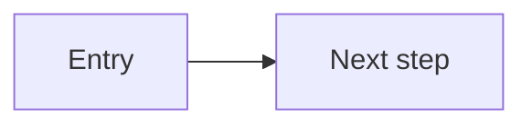

# Design wireframes — how to create this document

Use this file as the **shape and checklist** for `docs/design-wireframe.md` (or initiative-specific wireframe docs). Wireframes here mean **low- to mid-fidelity** layout and flow specs: screen inventory, navigation, states, and annotations—not final visual design.

**Do not** paste a full wireframe pack from another product. Rebuild **screen IDs**, flows, and notes from **this** initiative’s PRD and technical design.

**Template used (for derived docs):** record `docs/templates/design-wireframe-template.md` in document control per [documentation governance](../../.cursor/rules/docs-governance.mdc).

**How to produce content:** follow `.cursor/skills/designer-wireframe/SKILL.md` for conventions (ASCII boxes, mermaid flowcharts, empty/loading/error states).

**Out of scope here:** operational health or readiness HTTP routes and probe semantics belong in the technical design (`docs/templates/technical-design-template.md` §6.1), not in wireframes—unless an NFR explicitly ties UX to availability signaling (rare).

---

## Document control

| Field | Value |
| --- | --- |
| **Title** | [Product name — wireframes] |
| **Version** | [0.1] |
| **Date** | [YYYY-MM-DD] |
| **Author** | [Name] |
| **PRD** | [Link + version] |
| **Technical design** | [Link + version] |
| **Fidelity** | e.g. Annotated low-fi \| Mid-fi |
| **Template used** | `docs/templates/design-wireframe-template.md` |

---

## 1. Summary

- **What this doc covers:** [Screens and flows in scope.]
- **Platform:** [e.g. responsive web, mobile app.]
- **Relationship to implementation:** [Stack pointers — link `docs/tech-stack.md` if the repo uses it.]

---

## 2. Assumptions

- [Viewport breakpoints, auth model, realtime assumptions, anything the PRD leaves open that UX must decide for layout.]

---

## 3. Screen inventory

| ID | Surface | Purpose |
| --- | --- | --- |
| **S1** | [Name] | [One line — why this screen exists.] |

Use stable IDs (**S1**, **L1**, **M1**, etc.) so PRD/TDD/dev plan can cross-reference them.

---

## 4. Navigation map

| From | To | Trigger |
| --- | --- | --- |
| **S1** | **S2** | [User action or system event] |

---

## 5. Global patterns

- **Chrome / shell:** [App bar, nav drawer, toasts, modals — what is global vs per-screen.]
- **Accessibility:** [Focus order, keyboard paths, live regions — tie to PRD NFRs.]
- **Errors and empty states:** [How they appear globally.]

---

## 6. User flow (optional diagram)



Replace with a flow that matches your product.

---

## 7. Wireframes by screen

For **each** screen ID from §3, use a repeating block:

### [ID] — [Screen title]

**Purpose:** [What the user accomplishes.]

**Layout:** ASCII sketch or bullet zones (header / main / footer).

**States:** default \| loading \| error \| empty — [what differs in each.]

**Annotations:** [Field limits, ARIA notes, copy hints, API or data dependencies.]

---

## 8. Design review notes (optional)

- [Open UX questions, risks, decisions pending product/engineering sign-off.]

---

## 9. Revision history

| Version | Date | Notes |
| --- | --- | --- |
| 0.1 | [YYYY-MM-DD] | Initial draft from template. |

---

## Minimal layout example (replace entirely)

Illustrates **one** screen block pattern only; delete this section when the real wireframes exist.

### X1 — Example placeholder screen

**Purpose:** Collect a single required input and submit.

**Layout (narrow):**

```
+------------------------------------------+
| [Title]                                  |
+------------------------------------------+
|  [ Label for primary field           ]   |
|  +------------------------------------+  |
|  |                                    |  |
|  +------------------------------------+  |
|  [ Primary action ]                      |
+------------------------------------------+
```

**Annotations:** Associate labels with inputs; primary action reachable via keyboard.
