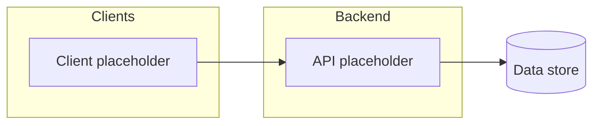

# Technical design — how to create this document

Use this file as the **shape and checklist** for `docs/technical-design.md` (or an initiative-specific TDD). Replace all placeholders; delete sections that do not apply.

**Do not** paste a full technical design from another product or repository. Re-derive architecture, APIs, and data from **this** initiative’s PRD and constraints.

**Template used (for derived docs):** record `docs/templates/technical-design-template.md` in document control per [documentation governance](../../.cursor/rules/docs-governance.mdc).

**Longer paste-ready TDD skeleton:** `.cursor/skills/technical-designer/reference.md` (use with the **technical-designer** skill).

**Small decisions only:** for narrow choices that do not warrant a full TDD update, use [`decision-log-template.md`](decision-log-template.md) / `docs/adr/` instead.

---

## Document control

| Field | Value |
| --- | --- |
| **Title** | [System or initiative name — technical design] |
| **Version** | [0.1] |
| **Author** | [Name] |
| **Engineering owner** | [Name] |
| **Reviewers** | [Names or roles] |
| **Date** | [YYYY-MM-DD] |
| **Status** | Draft \| In review \| Approved |
| **Related PRD** | [Link + version] |
| **Related docs** | [Wireframes, dev plan, tech stack, ADR index — links] |
| **Template used** | `docs/templates/technical-design-template.md` |

---

## AI-first delivery assumptions (if this repo uses that model)

- Assume AI-assisted implementation for sequencing and complexity unless a subsection explicitly calls for higher human-only effort.

---

## 1. Summary

- **Objective:** [What the system must deliver technically — one paragraph.]
- **Non-goals (technical):** [Explicit technical exclusions.]
- **Key decisions:** [Bullets — stack, trust boundaries, consistency model, etc.]

---

## 2. Context

- **Problem (from PRD):** [Restate in engineering terms.]
- **Users / systems affected:** [Actors and integrations.]
- **Constraints:** [Compliance, latency, hosting, team skills, deadlines.]

### 2.1 Context diagram (optional)

Replace with a diagram that matches your system.

---

## 3. Requirements traceability

Map **PRD IDs** (or user-story refs) to **where this document covers them** (section numbers or component names).

| Requirement ref | Summary | Design coverage |
| --- | --- | --- |
| **FR-01** | [Short] | [§ / component] |

---

## 4. Architecture

### 4.1 Components

| Component | Responsibility | Owner / location |
| --- | --- | --- |
| [Name] | [What it does] | [Repo path or service] |

### 4.2 Major flows

Describe **critical paths** (e.g. create resource, auth, async job). Link to sequence diagrams in an appendix if helpful.

### 4.3 Technology choices

| Area | Choice | Rationale | Alternatives considered |
| --- | --- | --- | --- |

---

## 5. Data design

- **Entities / schema:** [Tables, documents, indexes; migration strategy.]
- **Consistency:** [Transactions, idempotency, caching, event ordering.]
- **Retention / deletion:** [Policies affecting implementation.]

---

## 6. Interfaces

- **HTTP / RPC:** [Route groups, versioning, error model.]
- **Events / async:** [Topics, consumers, retry semantics.]
- **External integrations:** [Third parties, webhooks, SLAs.]

### 6.1 Health and readiness (deployment)

Load balancers, orchestrators, and PaaS often depend on a **stable health contract**. Document what operators and automation should call—do **not** assume a single repo-wide path unless your stack standardizes on one. **Frontend-only (static / CDN) deployments** may rely on **platform-managed** probes (e.g. object availability) or a trivial **public URL** check instead of an application **`/health` route**; state that explicitly if there is no origin app server for the web bundle.

**API on Railway (and similar PaaS):** Platform health checks expect an **HTTP path on the API** (common conventions: **`GET /health`** or **`GET /healthz`**). Document the exact path, success status (**`2xx`**), response time budget if any, and whether the handler is **liveness-only** (process up) vs **readiness** (e.g. optional **`SELECT 1`**). Keep synthetic probes **unauthenticated** unless the platform docs require otherwise; align the host’s **Healthcheck Path** (Railway) with this section.

- **Endpoints or probes:** [e.g. HTTP route(s), gRPC health, TCP-only checks, or “platform-managed only.”]
- **Liveness vs readiness:** [What each signal means; when instances should receive traffic.]
- **Dependencies checked:** [None / shallow (process up) / deep (e.g. database ping) — and how failures map to status codes or exit behavior.]
- **Auth / exposure:** [Typically unauthenticated for synthetic probes; note any exception or header requirements.]
- **Alignment:** [Timeouts, intervals, and failure thresholds used in staging vs production if non-default.]

---

## 7. Security and privacy

- **Trust boundaries:** [Diagram or bullet list.]
- **AuthN / AuthZ:** [Session, tokens, roles, sensitive operations.]
- **Threat notes:** [Top risks and mitigations.]

---

## 8. Performance and scalability

- **Expectations:** [SLOs if any; otherwise qualitative goals.]
- **Hot paths:** [Read/write patterns, caching, pagination.]

---

## 9. Observability

- **Logging:** [What to log; correlation IDs; PII rules.]
- **Metrics and tracing:** [What to measure for this initiative.]

---

## 10. Rollout and operations

- **Feature flags / migrations:** [Order of operations, backfill.]
- **Health / probes:** [Confirm §6.1 matches deployed probe configuration; update runbooks with curl or dashboard pointers when operators troubleshoot unhealthy instances.]
- **Runbooks:** [Link to `docs/runbook.md` or equivalent if operator steps change.]

---

## 11. Testing alignment

Point to **repo CI policy** (`AGENTS.md`, including **Engineering quality pillars**: **Vitest** unit/component coverage thresholds, **secure** behavior, and **layered review** expectations). List **initiative-specific** test themes (unit, integration, E2E, security checks). Link to a dedicated test strategy doc if you create one from [`test-strategy-template.md`](test-strategy-template.md).

---

## 12. Risks, open questions, and decisions

| Topic | Type | Notes / decision |
| --- | --- | --- |
| […] | Risk \| Question \| Decision | […] |

---

## Appendix (optional)

- **Glossary**
- **References** (PRD, wireframes, ADRs)

### Document history

| Version | Notes |
| --- | --- |
| 0.1 | Initial draft from template. |
